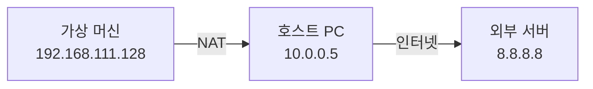
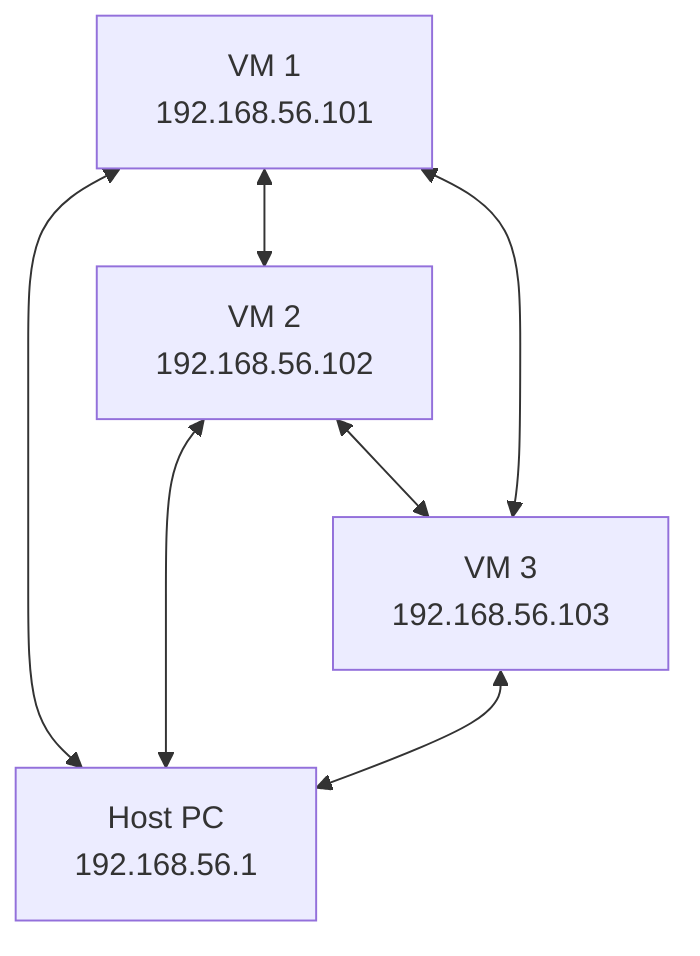
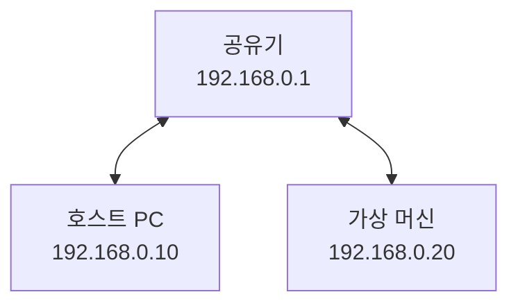

## 전체 흐름 요약

오늘 수업은 실제 3-Tier 웹 애플리케이션 아키텍처를 직접 구축하는 실습 중심의 학습입니다. VMware Workstation과 Ubuntu 24.04 LTS를 사용하여 가상 환경을 구성하고, 각 계층(Web Server - WAS - Database)을 단계별로 설치 및 설정합니다.

먼저 VMware의 네트워크 모드(NAT, Host-Only, Bridge)를 이해하고 Ubuntu를 설치합니다. 이후 Nginx 웹 서버를 설치하여 정적 콘텐츠를 서비스하고, Tomcat 10 WAS를 설치하여 JSP 동적 페이지를 처리합니다. MariaDB 데이터베이스를 설치하고 원격 접속을 설정한 후, 세 계층을 연동하여 로그인 시스템을 구현합니다.

마지막으로 구현한 로그인 시스템의 SQL Injection 취약점을 직접 공격해보고, Prepared Statement를 사용한 안전한 코드로 개선하는 과정을 통해 웹 보안의 중요성을 체험합니다.

---

## Part 1: 실습 환경 구축 (VMware + Ubuntu)

### 1.1 VMware Workstation 설치

#### 다운로드 및 설치

**다운로드:**
```
https://www.broadcom.com/
(회원가입 필요)

또는 교육 자료 공유 링크 활용
파일 크기: 약 280MB
```

**설치 과정:**
```
1. 설치 파일 실행
2. Next > Next > Install
3. Finish
```

**버전 확인:**
- VMware Workstation 17 Pro (무료 버전)
- 2023년 이후 개인 사용 무료화
- 이전 VMware Player 후속


### 1.2 네트워크 모드

#### NAT (Network Address Translation)

**특징:**
- 가상 머신 → 외부 인터넷 통신 가능
- 외부 → 가상 머신 직접 접근 불가
- VMware vmnet8 어댑터 사용

**비유:**
- 가상 머신 = 내부 네트워크 (192.168.x.x)
- 호스트 PC = 공유기
- 외부 인터넷 = 인터넷



**용도:**
- 외부 인터넷 필요한 작업
- 패키지 설치 (`apt-get install`)
- 시스템 업데이트

**IP 주소 범위:**
```
기본 네트워크: 192.168.111.0/24
게이트웨이: 192.168.111.2
DNS: 192.168.111.2
```

#### Host-Only

**특징:**
- 가상 머신들끼리만 통신
- 외부 인터넷 불가
- VMware vmnet1 어댑터 사용



**용도:**
- 가상 머신 간 통신 테스트
- 격리된 실습 환경
- 보안 실습 (외부 차단)

**IP 주소 범위:**
```
기본 네트워크: 192.168.56.0/24
호스트 IP: 192.168.56.1
```

#### Bridge

**특징:**
- 가상 머신이 물리 네트워크에 직접 연결
- 공유기로부터 독립적인 IP 할당
- 외부에서 접근 가능



**용도:**
- 외부에서 VM 서버 접속
- 실제 서비스 테스트
- 공인 IP 필요 시

**주의사항:**
- 공유기 IP 대역에 따라 달라짐
- DHCP로 자동 할당
- 공유기 설정에 따라 포트포워딩 필요

#### 네트워크 어댑터 확인

**Windows 명령:**
```bash
$ ipconfig

Ethernet adapter Ethernet3:
   IPv4 Address. . . . . . . . . . . : 192.168.0.10

Ethernet adapter VMware Network Adapter VMnet1:
   IPv4 Address. . . . . . . . . . . : 192.168.56.1

Ethernet adapter VMware Network Adapter VMnet8:
   IPv4 Address. . . . . . . . . . . : 192.168.111.1
```

- VMnet1: Host-Only
- VMnet8: NAT

### 1.3 Ubuntu 24.04 LTS 설치

#### ISO 다운로드

```
https://ubuntu.com/download/desktop

Ubuntu 24.04 LTS (Long Term Support)
- 10년 유지보수 보장
- 안정화 버전
- 파일 크기: 약 4.5GB
```

**LTS란?**
- 2년마다 출시 (22.04, 24.04, 26.04 ...)
- 10년간 보안 업데이트
- 서버/프로덕션 환경에 적합
- 일반 버전은 9개월 지원

#### VM 생성

**1. 새 가상 머신 만들기**
```
VMware > Create a New Virtual Machine
> Typical (recommended)
> I will install the operating system later
```

**2. 게스트 OS 선택**
```
> Linux
> Ubuntu 64-bit
```

**3. VM 이름 및 위치**
```
Name: ubuntu_24.04_web
Location: D:\VMs\ubuntu_24.04_web
```

**4. 디스크 용량**
```
Maximum disk size: 100 GB
> Store virtual disk as multiple files
(파일 분할 → 성능 향상)
```

**5. 하드웨어 설정**
```
Memory: 2 GB (2048 MB)
Processors: 1
Network: NAT
```

#### Ubuntu 설치 과정

**1. CD/DVD 설정**
```
VM Settings > CD/DVD (SATA)
> Use ISO image file
> Browse... > ubuntu-24.04-desktop-amd64.iso
```

**2. 부팅**
```
Power on this virtual machine
> Try or Install Ubuntu
```

**3. 설치 옵션**
```
언어: 한국어
키보드 레이아웃: 한국어
네트워크: 유선 연결 (자동)
업데이트: 지금 업데이트하지 않음
설치 유형: 디스크를 지우고 Ubuntu 설치
```

**4. 계정 생성**
```
이름: yoyo
컴퓨터 이름: yoyo-Server
사용자 이름: yoyo
암호: [암호 설정]
```

**5. 설치 완료**
```
설치 완료 > 다시 시작
ISO 제거 확인
```

#### 네트워크 확인

**IP 주소 확인:**
```bash
$ ip addr show

2: ens33: <BROADCAST,MULTICAST,UP,LOWER_UP>
    inet 192.168.111.128/24 brd 192.168.111.255 scope global dynamic ens33
```

**인터넷 연결 테스트:**
```bash
$ ping -c 4 8.8.8.8
PING 8.8.8.8 (8.8.8.8) 56(84) bytes of data.
64 bytes from 8.8.8.8: icmp_seq=1 ttl=116 time=34.2 ms
64 bytes from 8.8.8.8: icmp_seq=2 ttl=116 time=34.5 ms

--- 8.8.8.8 ping statistics ---
4 packets transmitted, 4 received, 0% packet loss
```

---

## Part 2: Nginx 웹 서버 설치 및 설정

### 2.1 Nginx 설치

#### 패키지 설치

**1. 관리자 권한 전환**
```bash
$ sudo su
[sudo] password for yoyo:
```

**2. Nginx 설치**
```bash
# apt-get install nginx -y
Reading package lists... Done
Building dependency tree... Done
...
Setting up nginx (1.24.0-2ubuntu7) ...
```

**3. 설치 확인**
```bash
# netstat -antp | grep nginx
tcp        0      0 0.0.0.0:80              0.0.0.0:*               LISTEN      1234/nginx: master
tcp6       0      0 :::80                   :::*                    LISTEN      1234/nginx: master
```

**포트 80 사용 확인:**
- 0.0.0.0:80 → 모든 네트워크 인터페이스에서 80번 포트 LISTEN
- LISTEN 상태 → 클라이언트 연결 대기 중

### 2.2 Nginx 서비스 관리

#### systemctl 명령어

**자동 시작 설정:**
```bash
# systemctl enable nginx
Synchronizing state of nginx.service with SysV service script with /lib/systemd/systemd-sysv-install.
Executing: /lib/systemd/systemd-sysv-install enable nginx
```

**자동 시작 해제:**
```bash
# systemctl disable nginx
```

**서비스 시작/재시작/중지:**
```bash
# systemctl start nginx      # 시작
# systemctl restart nginx    # 재시작
# systemctl stop nginx       # 중지
```

**서비스 상태 확인:**
```bash
# systemctl status nginx
● nginx.service - A high performance web server and a reverse proxy server
     Loaded: loaded (/lib/systemd/system/nginx.service; enabled; vendor preset: enabled)
     Active: active (running) since Mon 2024-12-17 09:00:00 KST; 5min ago
```

### 2.3 기본 웹 페이지 생성

#### 기본 디렉토리 확인

**웹 루트 디렉토리:**
```bash
/var/www/html/
```

**기본 파일 생성:**
```bash
# vi /var/www/html/index.html
```

**index.html 내용:**
```html
<html>
    <head>
        <title>My home~!</title>
    </head>
    
    <body>
        Hello? My page!
    </body>
</html>
```

**저장 및 종료:**
```
ESC
:wq
```

### 2.4 브라우저 접속 테스트

**VM IP 주소 확인:**
```bash
$ ip addr show ens33 | grep inet
    inet 192.168.111.128/24 brd 192.168.111.255 scope global dynamic ens33
```

**호스트 PC 브라우저에서 접속:**
```
http://192.168.111.128
```

**예상 결과:**
```
Hello? My page!
```

---

## Part 3: Tomcat 10 WAS 설치 및 JSP 테스트

### 3.1 Tomcat 설치

#### 패키지 설치

**1. Tomcat 10 설치:**
```bash
# sudo apt install tomcat10 tomcat10-admin
Reading package lists... Done
...
Setting up tomcat10 (10.1.20-1) ...
```

**2. 서비스 자동 시작 설정:**
```bash
# systemctl enable tomcat
```

**3. 서비스 시작:**
```bash
# systemctl start tomcat
```

**4. 포트 확인:**
```bash
# netstat -antp | grep LISTEN
tcp6       0      0 :::8080                 :::*                    LISTEN      5678/java
```

### 3.2 방화벽 설정 (참고)

**방화벽 상태 확인:**
```bash
# systemctl status ufw
● ufw.service - Uncomplicated firewall
     Loaded: loaded (/lib/systemd/system/ufw.service; enabled; vendor preset: enabled)
     Active: active (exited)
```

**방화벽 on/off:**
```bash
# systemctl stop ufw     # 방화벽 끄기
# systemctl start ufw    # 방화벽 켜기
```

**실습 환경에서는 방화벽 끄기 권장:**
```bash
# systemctl stop ufw
```

### 3.3 Tomcat 디렉토리 구조

**주요 디렉토리:**
```
/var/lib/tomcat10/              # Tomcat 기본 디렉토리
/var/lib/tomcat10/webapps/      # 웹 애플리케이션 배포 디렉토리
/var/lib/tomcat10/webapps/ROOT/ # 기본 웹 애플리케이션
```

**ROOT 디렉토리:**
- 톰캣의 기본 웹 애플리케이션
- 브라우저에서 `http://192.168.186.129:8080/`로 접속 시 표시

### 3.4 JSP 테스트 페이지 작성

#### 기본 JSP 파일 생성

**1. 파일 생성:**
```bash
# vi /var/lib/tomcat10/webapps/ROOT/test.jsp
```

**2. JSP 코드 작성:**
```jsp
<%@ page language="java" contentType="text/html; charset=UTF-8" 
    pageEncoding="UTF-8"%>
<!DOCTYPE html>
<html>
<head>
    <meta charset="UTF-8">
    <title>Tomcat JSP Test</title>
</head>
<body>
    <h2>Tomcat JSP 정상 동작 확인!</h2>
    
    <p>현재 서버 시간: <%= new java.util.Date() %></p>
    <p>서버 정보: <%= application.getServerInfo() %></p>
    
    <hr>
    <p style="color:green;">JSP가 정상적으로 실행되고 있습니다.</p>
</body>
</html>
```

**3. 저장:**
```
ESC
:wq
```

#### 브라우저 접속 테스트

**접속 URL:**
```
http://192.168.186.129:8080/test.jsp
```

**예상 화면:**
```
Tomcat JSP 정상 동작 확인!

현재 서버 시간: Mon Dec 17 10:30:45 KST 2024
서버 정보: Apache Tomcat/10.1.20

JSP가 정상적으로 실행되고 있습니다.
```

### 3.5 Nginx와 Tomcat 연동

#### Nginx 설정 파일 수정

**1. 설정 파일 편집:**
```bash
# vi /etc/nginx/sites-enabled/default
```

**2. server 블록 내용 수정:**
```nginx
server {
    listen 80 default_server;
    server_name _;
    
    location / {
        index index.jsp index.html index.htm;
        proxy_pass http://192.168.186.129:8080;
    }
}
```

**설정 설명:**
- `listen 80`: 80번 포트에서 HTTP 요청 수신
- `server_name _`: 모든 도메인 허용
- `proxy_pass`: 요청을 Tomcat(8080)으로 전달

**3. Nginx 재시작:**
```bash
# systemctl restart nginx
```

**4. 연동 테스트:**
```
브라우저에서 http://192.168.186.129 접속
→ Tomcat의 ROOT 애플리케이션이 표시됨
```

---

## Part 4: MariaDB 데이터베이스 설치 및 설정

### 4.1 MariaDB 설치

#### 서버 설치

**1. MariaDB 서버 설치:**
```bash
# sudo su
# apt-get install mariadb-server
Reading package lists... Done
...
Setting up mariadb-server (1:10.11.7-1ubuntu2) ...
```

**2. 서비스 자동 시작 설정:**
```bash
# systemctl enable mariadb
```

**3. 포트 확인:**
```bash
# netstat -antp | grep LISTEN
tcp        0      0 127.0.0.1:3306          0.0.0.0:*               LISTEN      9876/mariadbd
```

**127.0.0.1:3306:**
- 127.0.0.1 → localhost만 접속 가능 (로컬 전용)
- 원격 접속을 위해서는 설정 변경 필요

### 4.2 원격 접속 설정

#### bind-address 변경

**1. 설정 파일 경로 확인:**
```bash
# cd /etc/mysql
# grep "127.0.0.1" -r ./
./mariadb.conf.d/50-server.cnf:bind-address            = 127.0.0.1
```

**2. 설정 파일 수정:**
```bash
# vi ./mariadb.conf.d/50-server.cnf
```

**3. bind-address 변경:**
```
변경 전: bind-address = 127.0.0.1
변경 후: bind-address = 0.0.0.0
```

**0.0.0.0의 의미:**
- 모든 네트워크 인터페이스에서 접속 허용
- 외부에서 DB 접근 가능

**4. MariaDB 재시작:**
```bash
# systemctl restart mariadb
```

**5. 포트 재확인:**
```bash
# netstat -antp | grep LISTEN
tcp        0      0 0.0.0.0:3306            0.0.0.0:*               LISTEN      10234/mariadbd
```

### 4.3 데이터베이스 및 사용자 생성

#### root 접속

**1. MariaDB 접속:**
```bash
# mysql -u root
Welcome to the MariaDB monitor.  Commands end with ; or \g.
...
MariaDB [(none)]>
```

**2. 데이터베이스 사용자 생성:**
```sql
CREATE USER 'mydb'@'%' IDENTIFIED BY 'abcd1234';
```

**문법 설명:**
- `mydb`: 사용자 이름
- `%`: 모든 호스트에서 접속 허용
- `abcd1234`: 비밀번호

**3. 권한 부여:**
```sql
GRANT ALL PRIVILEGES ON *.* TO 'mydb'@'%' WITH GRANT OPTION;
```

**권한 설명:**
- `ALL PRIVILEGES`: 모든 권한 부여
- `*.*`: 모든 데이터베이스의 모든 테이블
- `WITH GRANT OPTION`: 다른 사용자에게 권한 부여 가능

**4. 권한 적용:**
```sql
FLUSH PRIVILEGES;
```

**5. 종료:**
```sql
exit
```

### 4.4 데이터베이스 및 테이블 생성

#### 데이터베이스 생성

**1. mydb 사용자로 접속:**
```bash
# mysql -u mydb -p
Enter password: abcd1234
```

**2. 데이터베이스 생성:**
```sql
DROP DATABASE IF EXISTS cloud_db;
CREATE DATABASE cloud_db;
USE cloud_db;
```

**3. 테이블 생성:**
```sql
CREATE TABLE userInfo (
    uid INT,
    uname VARCHAR(20),
    pass VARCHAR(128),
    profile VARCHAR(200),
    priority INT
);
```

**4. 테이블 구조 확인:**
```sql
DESC userInfo;
```

**출력:**
```
+----------+--------------+------+-----+---------+-------+
| Field    | Type         | Null | Key | Default | Extra |
+----------+--------------+------+-----+---------+-------+
| uid      | int(11)      | YES  |     | NULL    |       |
| uname    | varchar(20)  | YES  |     | NULL    |       |
| pass     | varchar(128) | YES  |     | NULL    |       |
| profile  | varchar(200) | YES  |     | NULL    |       |
| priority | int(11)      | YES  |     | NULL    |       |
+----------+--------------+------+-----+---------+-------+
```

**5. 데이터 입력:**
```sql
INSERT INTO userInfo (uid, uname, pass, profile, priority)
VALUES(0, 'admin', '1234', '관리자', 0);

INSERT INTO userInfo (uid, uname, pass, profile, priority)
VALUES(1, 'usr1', 'abcd', '사용자1', 9);

INSERT INTO userInfo (uid, uname, pass, profile, priority)
VALUES(2, 'usr2', 'abcd', '사용자2', 9);

INSERT INTO userInfo (uid, uname, pass, profile, priority)
VALUES(3, 'usr3', 'abcd', '사용자3', 9);
```

**6. 데이터 확인:**
```sql
SELECT * FROM userInfo;
```

**출력:**
```
+------+-------+------+-----------+----------+
| uid  | uname | pass | profile   | priority |
+------+-------+------+-----------+----------+
|    0 | admin | 1234 | 관리자    |        0 |
|    1 | usr1  | abcd | 사용자1   |        9 |
|    2 | usr2  | abcd | 사용자2   |        9 |
|    3 | usr3  | abcd | 사용자3   |        9 |
+------+-------+------+-----------+----------+
```

---

## Part 5: 3-Tier 연동 및 로그인 시스템 구현

### 5.1 WAS에서 DB 접속 확인

#### MariaDB JDBC 드라이버 설치

**1. 클라이언트 프로그램 설치:**
```bash
# apt install mariadb-client-core -y
```

**2. 원격 접속 테스트:**
```bash
# mysql -u mydb -p -h 92.168.186.130
Enter password: abcd1234

MariaDB [(none)]> SHOW DATABASES;
+--------------------+
| Database           |
+--------------------+
| cloud_db           |
| information_schema |
| mysql              |
| performance_schema |
| sys                |
+--------------------+
```

#### JDBC 커넥터 설치

**1. Java 커넥터 설치:**
```bash
# apt install libmariadb-java
```

**2. 파일 생성 확인:**
```bash
# ls -al /usr/share/java/mariadb-java-client.jar
-rw-r--r-- 1 root root 730645 Dec 17 10:00 /usr/share/java/mariadb-java-client.jar
```

**3. Tomcat 라이브러리로 복사:**
```bash
# ln -s /usr/share/java/mariadb-java-client.jar /var/lib/tomcat10/lib/
```

**심볼릭 링크란?**
- 윈도우의 "바로가기"와 유사
- 원본 파일을 가리키는 링크
- 원본 파일 수정 시 링크를 통해서도 변경사항 반영

**4. Tomcat 재시작:**
```bash
# systemctl restart tomcat10
```

**주의사항:**
- `systemctl daemon-reload`는 unit 파일 변경 시에만 필요
- 일반 설정 변경은 `restart`만으로 충분

### 5.2 로그인 페이지 작성

#### login.html 생성

**1. 파일 생성:**
```bash
# vi /var/lib/tomcat10/webapps/ROOT/login.html
```

**2. HTML 코드:**
```html
<!DOCTYPE html>
<html lang="ko">
<head>
    <meta charset="UTF-8">
    <title>Login</title>
</head>
<body>
    <h2>로그인</h2>

    <form action="./login.jsp" method="post">
        <div>
            <label for="username">아이디</label><br>
            <input type="text" id="username" name="username" required>
        </div>

        <br>

        <div>
            <label for="password">비밀번호</label><br>
            <input type="password" id="password" name="password" required>
        </div>

        <br>

        <button type="submit">로그인</button>
    </form>
</body>
</html>
```

**3. 브라우저 접속 테스트:**
```
http://192.168.186.129:8080/login.html
```

#### index.html 생성

**1. 파일 생성:**
```bash
# vi /var/lib/tomcat10/webapps/ROOT/index.html
```

**2. HTML 코드:**
```html
<!DOCTYPE html>
<html lang="ko">
<head>
    <meta charset="UTF-8">
    <title>로그인 성공</title>
</head>
<body>
    <h1>환영합니다!</h1>
    <p>로그인에 성공했습니다.</p>
</body>
</html>
```

### 5.3 login.jsp 작성 (취약한 버전)

#### 취약한 로그인 처리

**1. 파일 생성:**
```bash
# vi /var/lib/tomcat10/webapps/ROOT/login.jsp
```

**2. JSP 코드:**
```jsp
<%@ page language="java" contentType="text/html; charset=UTF-8" 
    pageEncoding="UTF-8" import="java.sql.*"%>
<!DOCTYPE html PUBLIC "-//W3C//DTD HTML 4.01 Transitional//EN" "http://www.w3.org/TR/html4/loose.dtd">

<%
String uid = request.getParameter("username");
String pwd = request.getParameter("password");
String DB_URL = "jdbc:mariadb://192.168.186.130:3306/cloud_db";
String DB_USER = "mydb";
String DB_PASSWORD= "abcd1234";
String sel = "";
ResultSet rs = null;
Connection conn;
Statement stmt;

try {
    Class.forName("org.mariadb.jdbc.Driver");
    conn = DriverManager.getConnection(DB_URL, DB_USER, DB_PASSWORD);
    stmt = conn.createStatement();
    
    // 사용자 정보 조회 (SQL Injection 취약점!)
    sel = "SELECT * FROM userInfo WHERE uname='" + uid + "' AND pass='" + pwd + "'";
    rs = stmt.executeQuery(sel);
    
    if (rs.next()) {
        response.sendRedirect("index.html");
    } else {
        response.sendRedirect("login.html");
    }
    
    conn.close();
} catch(Exception e) {
    out.println(e.getMessage());
}
%>
```

**코드 설명:**

**데이터베이스 연결 정보:**
```java
String DB_URL = "jdbc:mariadb://192.168.186.130:3306/cloud_db";
String DB_USER = "mydb";
String DB_PASSWORD= "abcd1234";
```

**JDBC 드라이버 로드:**
```java
Class.forName("org.mariadb.jdbc.Driver");
```

**데이터베이스 연결:**
```java
conn = DriverManager.getConnection(DB_URL, DB_USER, DB_PASSWORD);
stmt = conn.createStatement();
```

**취약한 SQL 쿼리 생성:**
```java
sel = "SELECT * FROM userInfo WHERE uname='" + uid + "' AND pass='" + pwd + "'";
rs = stmt.executeQuery(sel);
```

**로그인 성공/실패 처리:**
```java
if (rs.next()) {
    response.sendRedirect("index.html");  // 로그인 성공
} else {
    response.sendRedirect("login.html");  // 로그인 실패
}
```

### 5.4 정상 로그인 테스트

#### 로그인 시도

**1. login.html 접속:**
```
http://192.168.186.129:8080/login.html
```

**2. 정상 계정 입력:**
```
아이디: admin
비밀번호: 1234
```

**3. 실행되는 SQL:**
```sql
SELECT * FROM userInfo WHERE uname='admin' AND pass='1234'
```

**4. 결과:**
- 데이터베이스에 일치하는 레코드 존재
- `rs.next()` → true
- `index.html`로 리다이렉트
- "환영합니다!" 메시지 표시

---

## Part 6: SQL Injection 실습

### 6.1 SQL Injection이란?

#### 개념

**정의:**
SQL Injection은 사용자 입력값을 통해 악의적인 SQL 쿼리를 실행하여 데이터베이스를 조작하거나 무단 접근하는 공격 기법입니다.

**취약점 원인:**
```java
// 취약한 코드
sel = "SELECT * FROM userInfo WHERE uname='" + uid + "' AND pass='" + pwd + "'";
```

사용자 입력(`uid`, `pwd`)을 직접 SQL 쿼리에 연결하여 SQL 구문을 조작할 수 있습니다.

#### 공격 원리

**정상 쿼리:**
```sql
SELECT * FROM userInfo WHERE uname='admin' AND pass='1234'
```

**공격 쿼리:**
```sql
SELECT * FROM userInfo WHERE uname='admin' OR '1'='1' -- ' AND pass=''
```

**'1'='1'의 의미:**
- 항상 참(TRUE)인 조건
- OR 연산자와 결합하여 전체 WHERE 조건을 무력화
- `--`는 SQL 주석 처리로 뒤의 조건 무시

### 6.2 SQL Injection 공격 실습

#### 시나리오 1: 로그인 우회

**1. login.html 접속**

**2. 공격 입력:**
```
아이디: admin' OR '1'='1' --  
비밀번호: (아무거나 또는 공백)
```

**3. 실행되는 SQL:**
```sql
SELECT * FROM userInfo WHERE uname='admin' OR '1'='1' -- ' AND pass=''
```

**4. SQL 분석:**
```sql
SELECT * FROM userInfo 
WHERE uname='admin'          -- admin 계정 찾기
   OR '1'='1'                -- 또는 항상 참
   --  ' AND pass=''         -- 이후 구문은 주석 처리
```

**5. 결과:**
- `'1'='1'`은 항상 참
- WHERE 조건이 항상 참이므로 모든 레코드 반환
- `rs.next()` → true
- 로그인 성공!

#### 시나리오 2: 전체 사용자 조회

**공격 입력:**
```
아이디: ' OR '1'='1
비밀번호: (공백)
```

**실행되는 SQL:**
```sql
SELECT * FROM userInfo WHERE uname='' OR '1'='1' AND pass=''
```

**결과:**
- 모든 사용자 레코드 반환
- 첫 번째 사용자(admin)로 로그인

#### 시나리오 3: UNION 기반 공격

**공격 입력:**
```
아이디: admin' UNION SELECT 0, 'hacker', '0000', 'attacker', 0 --  
비밀번호: (공백)
```

**실행되는 SQL:**
```sql
SELECT * FROM userInfo WHERE uname='admin' 
UNION 
SELECT 0, 'hacker', '0000', 'attacker', 0 
-- ' AND pass=''
```

**결과:**
- UNION으로 임의의 레코드 추가
- 존재하지 않는 계정으로 로그인 가능

### 6.3 SQL Injection 영향

#### 피해 범위

**1. 인증 우회:**
- 비밀번호 없이 로그인
- 관리자 계정 탈취

**2. 데이터 유출:**
```sql
admin' UNION SELECT uid, uname, pass, profile, priority FROM userInfo --
```
- 모든 사용자 정보 조회
- 개인정보 유출

**3. 데이터 변조:**
```sql
admin'; UPDATE userInfo SET pass='0000' WHERE uname='admin' --
```
- 관리자 비밀번호 변경
- 데이터 무결성 훼손

**4. 데이터 삭제:**
```sql
admin'; DROP TABLE userInfo --
```
- 테이블 전체 삭제
- 서비스 마비

### 6.4 안전한 코드 작성 (Prepared Statement)

#### 보안 개선 버전

**1. 안전한 login.jsp 생성:**
```bash
# vi /var/lib/tomcat10/webapps/ROOT/login_safe.jsp
```

**2. Prepared Statement 사용:**
```jsp
<%@ page language="java" contentType="text/html; charset=UTF-8" 
    pageEncoding="UTF-8" import="java.sql.*"%>
<!DOCTYPE html PUBLIC "-//W3C//DTD HTML 4.01 Transitional//EN" "http://www.w3.org/TR/html4/loose.dtd">

<%
String uid = request.getParameter("username");
String pwd = request.getParameter("password");
String DB_URL = "jdbc:mariadb://192.168.186.130:3306/cloud_db";
String DB_USER = "mydb";
String DB_PASSWORD= "abcd1234";
ResultSet rs = null;
Connection conn = null;
PreparedStatement pstmt = null;

try {
    Class.forName("org.mariadb.jdbc.Driver");
    conn = DriverManager.getConnection(DB_URL, DB_USER, DB_PASSWORD);
    
    // Prepared Statement 사용 (안전!)
    String sql = "SELECT * FROM userInfo WHERE uname=? AND pass=?";
    pstmt = conn.prepareStatement(sql);
    pstmt.setString(1, uid);   // 첫 번째 ? 에 uid 바인딩
    pstmt.setString(2, pwd);   // 두 번째 ? 에 pwd 바인딩
    
    rs = pstmt.executeQuery();
    
    if (rs.next()) {
        response.sendRedirect("index.html");
    } else {
        response.sendRedirect("login.html");
    }
    
    conn.close();
} catch(Exception e) {
    out.println(e.getMessage());
} finally {
    if (rs != null) rs.close();
    if (pstmt != null) pstmt.close();
    if (conn != null) conn.close();
}
%>
```

#### Prepared Statement 작동 원리

**1. SQL 템플릿 준비:**
```java
String sql = "SELECT * FROM userInfo WHERE uname=? AND pass=?";
pstmt = conn.prepareStatement(sql);
```

**2. 파라미터 바인딩:**
```java
pstmt.setString(1, uid);   // ? 위치에 값 설정
pstmt.setString(2, pwd);
```

**3. 쿼리 실행:**
```java
rs = pstmt.executeQuery();
```

**보안 메커니즘:**
- SQL 구문과 데이터를 분리
- 사용자 입력은 단순 데이터로만 처리
- SQL 특수문자 자동 이스케이핑
- SQL 구문 조작 불가능

**공격 시도 시:**
```
입력: admin' OR '1'='1' --
SQL: SELECT * FROM userInfo WHERE uname='admin\' OR \'1\'=\'1\' -- ' AND pass=?
결과: 문자열 "admin' OR '1'='1' --"로 검색 → 일치하는 레코드 없음 → 로그인 실패
```

### 6.5 추가 보안 대책

#### 입력값 검증

**1. 화이트리스트 검증:**
```java
// 허용할 문자만 패턴 검사
String pattern = "^[a-zA-Z0-9]{4,20}$";
if (!uid.matches(pattern)) {
    out.println("잘못된 입력입니다.");
    return;
}
```

**2. 특수문자 필터링:**
```java
// SQL 특수문자 제거
uid = uid.replaceAll("[';\"--]", "");
```

#### 최소 권한 원칙

**데이터베이스 사용자 권한 제한:**
```sql
-- 읽기 전용 권한만 부여
GRANT SELECT ON cloud_db.* TO 'webuser'@'%' IDENTIFIED BY 'password';

-- 특정 테이블만 접근 허용
GRANT SELECT ON cloud_db.userInfo TO 'webuser'@'%';
```

#### 에러 메시지 숨기기

**개발 환경:**
```java
catch(Exception e) {
    out.println(e.getMessage());  // 상세 에러 표시
}
```

**프로덕션 환경:**
```java
catch(Exception e) {
    out.println("로그인 중 오류가 발생했습니다.");  // 일반적인 메시지만
    // 실제 에러는 로그 파일에만 기록
    logger.error("Login error", e);
}
```

#### 로깅 및 모니터링

**의심스러운 활동 감지:**
```java
// 로그인 실패 횟수 카운트
if (failCount > 5) {
    // IP 차단 또는 CAPTCHA 요구
}

// SQL Injection 시도 탐지
if (uid.contains("'") || uid.contains("--") || uid.contains("OR")) {
    logger.warn("SQL Injection 시도 감지: " + uid);
}
```

---

## 주요 개념 요약표

| 구분 | 주요 개념 | 설명 |
|------|----------|------|
| **가상화** | VMware | 가상 머신 관리 플랫폼 |
| | VM | 물리 서버 내 독립적인 가상 서버 |
| | 스냅샷 | VM의 특정 시점 상태 저장 |
| **네트워크** | NAT | 외부 인터넷 접근, 내부 IP 사용 |
| | Host-Only | VM 간 통신만, 인터넷 차단 |
| | Bridge | 물리 네트워크 직접 연결 |
| **웹 서버** | Nginx | 고성능 웹 서버, 리버스 프록시 |
| | 정적 파일 | HTML, CSS, JS, 이미지 |
| | 프록시 패스 | 요청을 다른 서버로 전달 |
| **WAS** | Tomcat | Java 서블릿/JSP 실행 엔진 |
| | JSP | Java Server Pages (동적 웹) |
| | webapps | 웹 애플리케이션 배포 디렉토리 |
| **데이터베이스** | MariaDB | MySQL 호환 오픈소스 DBMS |
| | JDBC | Java Database Connectivity |
| | bind-address | DB 서버 접근 허용 IP |
| **3-Tier** | Presentation | 웹 브라우저 (클라이언트) |
| | Application | 웹 서버 + WAS |
| | Data | 데이터베이스 서버 |
| **보안** | SQL Injection | SQL 쿼리 조작 공격 |
| | Prepared Statement | 파라미터 바인딩으로 방어 |
| | 입력값 검증 | 화이트리스트, 특수문자 필터링 |
| | 최소 권한 | 필요한 권한만 부여 |
| **Linux** | systemctl | 서비스 관리 명령어 |
| | netstat | 네트워크 상태 확인 |
| | vi/vim | 텍스트 에디터 |
| | apt-get | 패키지 관리자 (Debian 계열) |

---

## 마무리

이번 강의에서는 3-Tier 웹 애플리케이션 아키텍처를 직접 구축하고 보안 취약점을 실습했습니다. VMware와 Ubuntu를 이용해 가상 환경을 구성하고, Nginx 웹 서버, Tomcat WAS, MariaDB 데이터베이스를 단계별로 설치하여 완전한 웹 서비스 인프라를 구성했습니다.

Nginx는 정적 파일을 서비스하고 프록시 역할을 수행하며, Tomcat은 JSP를 통해 동적 콘텐츠를 생성하고, MariaDB는 사용자 정보를 안전하게 저장합니다. 이 세 계층을 연동하여 실제 동작하는 로그인 시스템을 구현했습니다.

SQL Injection 실습을 통해 입력값 검증의 중요성을 체험했습니다. 취약한 코드에서는 단순한 입력 조작만으로 인증을 우회할 수 있었으나, Prepared Statement를 사용한 안전한 코드에서는 SQL 구문과 데이터가 분리되어 공격이 차단되었습니다.

**핵심 교훈:**
1. **계층 분리의 중요성**: 각 계층이 독립적으로 동작하며 역할이 명확히 구분됨
2. **보안은 설계 단계부터**: 개발 초기부터 보안을 고려한 코드 작성 필요
3. **입력값은 신뢰할 수 없음**: 모든 사용자 입력은 검증하고 안전하게 처리
4. **Prepared Statement는 필수**: SQL Injection 방어의 기본이자 핵심

**참고 자료:**

- Nginx 공식 문서: https://nginx.org/en/docs/
- Tomcat 공식 문서: https://tomcat.apache.org/tomcat-10.1-doc/
- MariaDB 문서: https://mariadb.com/kb/en/
- OWASP SQL Injection: https://owasp.org/www-community/attacks/SQL_Injection
