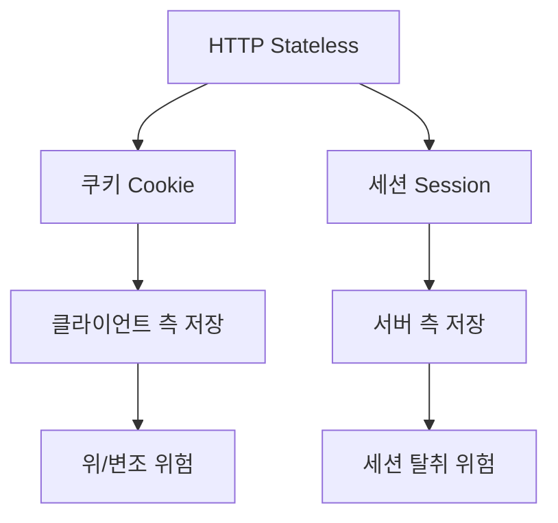
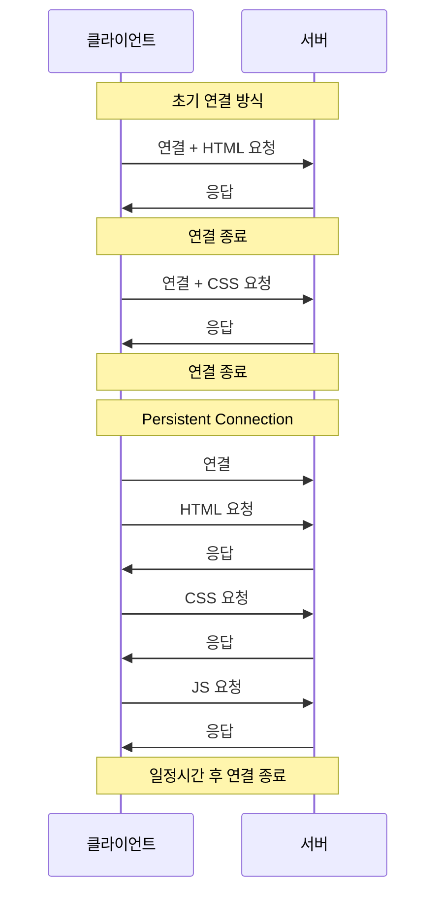

## 개요

이 문서에서는 웹 보안의 기초가 되는 HTTP 프로토콜의 특징과 Apache 웹 서버의 동작 원리, 그리고 웹 보안 취약점에 대해 다룹니다. HTTP의 Stateless와 Connectionless 특성을 이해하고, 쿠키/세션을 통한 상태 관리, 캐시 제어, SSL/TLS 암호화 통신에 대해 학습합니다.

## Apache Web 서버

### HTTP (HyperText Transfer Protocol)

HTTP는 WWW(World Wide Web) 상에서 정보를 주고받을 수 있는 프로토콜입니다. 주로 HTML 문서를 주고받는 데 사용되며, 클라이언트와 서버 사이의 요청(Request)/응답(Response) 프로토콜입니다.

### 웹 서버 동작 방식

**정적 웹 서버(Static Web Server)**
- HTML과 같은 정적 데이터만 처리합니다
- 요청 시마다 동일한 데이터를 전송합니다
- 호출한 파일을 클라이언트로 가져와서 실행합니다
- CSSL(Client Side Scripts Language): HTML, CSS, JavaScript 등

**동적 웹 서버(Dynamic Web Server)**
- 동적 데이터 처리를 위해 웹 스크립트 언어 모듈이 필요합니다
- ASP(Active Server Page), PHP, JSP(Java Server Page), Python, Perl 등
- 호출한 파일을 서버에서 실행시켜 결과값을 전송합니다
- SSSL(Server Side Script Language): JSP, PHP, Servlet, CGI, ASP 등

### CGI (Common Gateway Interface)

CGI는 웹 페이지에 동적인 작업을 할 수 있도록 하는 기술입니다.

**특징:**
- 웹 서버와 백엔드 프로그램 사이에서 정보를 주고받는 인터페이스입니다
- CGI 규약만 준수하면 어떤 언어로도 개발 가능합니다
- 한 요청당 한 프로세스가 생성되어 처리 후 종료됩니다 (부하가 큼)

**프로세스와 스레드:**
- 프로세스(Process): 프로그램이 실행 중인 상태
- 스레드(Thread): 프로세스 내부의 일부분
- 예: 은행(프로세스) 안의 각 창구(스레드)

### 확장 CGI

| 종류 | 설명 |
|------|------|
| **ASP** (Active Server Page) | Microsoft에서 만든 확장 CGI 기술<br/>비주얼 베이직 문법을 사용하여 동적 콘텐츠 생성<br/>ActiveX 컴포넌트를 접근 가능<br/>특정 웹 서버(IIS)와 윈도우 OS에서만 동작 |
| **PHP** (Personal HomePage Tools, Professional Hypertext Preprocessor) | C언어와 문법이 유사하며, 적은 명령어를 필 프로그래밍 가능<br/>리눅스 환경 소스가 공개되어 있음<br/>특정한 요구툴에 대한 기능들이 미리만든 것이 단점 |
| **Servlet** (Server + Applet) | 웹상 CGI방식은 Sun 사에서 내놓은 기술<br/>Java 언어를 기반으로 동적인 콘텐츠를 생성하는 기술을 제공<br/>Java코드안에 HTML 태그가 혼재되어 있어 작업에 대한 혼란과부적 불편함이 발어짐 |
| **JSP** (Java Server Page) | Java 언어를 기반으로 만들어졌으며, ASP, PHP 처럼 HTML 태그 사이에 동적 콘텐츠 생성을 담당할 Java코드가 들어가 객체<br/>동적 콘텐츠 생성을 위해 스크립틀릿 언어 형식으로 프로그램 작성 가능<br/>서블릿 장의면그를 기능 확장이 가능함<br/>JSP는 J2EE(Java 2 Enterprise Edition) API의 한 부분으로 웹 어플리케이션을 개발하기 위한 언어 |

## HTTP 프로토콜 특징 ⭐

### 1. Stateless 프로토콜

클라이언트의 상태정보를 유지하지 않는 프로토콜입니다.

**특징:**
- 동일한 클라이언트가 재접속해도 클라이언트를 식별하지 못합니다
- 장점: 서버의 확장성이 높아집니다 (스케일 아웃)
- 단점: 클라이언트의 추가 데이터 전송이 필요합니다

**상태 정보 유지 기술:**



**쿠키(Cookie) - 클라이언트 측:**
- 클라이언트 상태를 유지할 정보를 일정시간/기간 동안 저장합니다
- 단점: 클라이언트 PC에 저장되므로 위/변조가 쉽습니다

**세션(Session) - 서버 측:**
- 종류: Session, persistent cookie, session cookie, transient cookie
- 세션 ID를 통해 클라이언트 상태정보를 저장합니다
- 세션 쿠키(메모리 쿠키)를 이용하여 웹 브라우저 기동 중에만 유지됩니다
- 단점: 세션 탈취 문제가 존재합니다

### 2. Connectionless 프로토콜

연결상태를 유지하지 않는 프로토콜입니다.

**동작 흐름:**
```
TCP 연결 요청 → 요청/응답 → TCP 연결 종료
```

**장점:**
- 서버 자원을 효율적으로 사용할 수 있습니다

**문제점:**
- TCP/IP 연결을 새로 맺어야 합니다 (3-way handshake 시간 추가)
- 웹 페이지 요청 시 HTML, CSS, JS, 이미지 등 많은 자원을 다운로드해야 합니다

**해결책:**
- HTTP/1.1: Connection 설정에 keep-alive 속성 추가 (Persistent Connection)
- HTTP/2, HTTP/3: 더 많은 최적화



## HTTP 요청 메소드

### 주요 메소드

| 메소드 | 설명 |
|--------|------|
| **GET** | 서버로부터 문서를 읽어올 때 사용<br/>URL에 정의되며 문서를 검색하는 주요 메소드 |
| **POST** | 서버에게 정보를 제공할 때 사용 |
| **PUT** | 서버에 새 문서 또는 교체 문서를 제공하기 위해 사용 |
| **DELETE** | 서버에서 문서를 제거하기 위해 사용 |
| **HEAD** | 문서 자체가 아닌 문서 정보를 원할 때 사용<br/>GET과 비슷하지만 응답에 본문이 없음 |
| **OPTIONS** | 서버에게 사용 가능한 옵션을 질의하기 위해 사용 |
| **PATCH** | 기존 파일에서 구현되어야 하는 변경사항 목록만 포함 |

## URI와 URL

### URL (Uniform Resource Locator)

네트워크 상에서 자원을 요청하는 규약입니다.

```
https://www.naver.com:443/list.nhn?mode=LSD&sid=001
  ↓        ↓         ↓     ↓              ↓
프로토콜  주소/IP   포트  리소스경로   쿼리스트링
```

**구성요소:**
- **프로토콜(Protocol)**: https
- **주소 또는 IP**: www.naver.com
- **포트(Port)**: 443
- **리소스 경로**: /list.nhn
- **쿼리 스트링**: ?mode=LSD&sid=001

### URL 인코딩/디코딩 (%인코딩)

**사용 목적:**
- URL로 전송할 수 있는 문자는 ASCII 문자만 가능합니다
- ASCII 예약 문자는 이스케이프 처리가 필요합니다 (/, &, = 등)

**변환 규칙:**
- UTF-8 준수, 한글 1글자는 3byte로 인코딩됩니다
- 공백 문자는 '%20' 또는 '+'로 인코딩됩니다
- 특수 문자 ~, -, _, !, *, ', ()은 변환에서 제외됩니다

### Base64 인코딩

8비트 이진 데이터를 ASCII 영역의 문자들로 바꾸는 인코딩 방식입니다.

**특징:**
- Binary Data를 Text로 변경하는 인코딩입니다
- Binary Data를 6 bit씩 자른 뒤 Base64 색인표에서 찾아 치환합니다
- HTML 또는 Email에 Binary Data를 포함할 때 사용합니다

## 데이터 전송 방식

### GET 방식 (쿼리 스트링)

```
http://example.com/page?변수=데이터&변수=데이터
                        ↑
                      쿼리 스트링
```

**특징:**
- URL로 데이터를 전송합니다
- IP, PW 등을 GET으로 보내면 URL에 노출됩니다
- `?` 뒤에 변수=데이터&변수=데이터 형태로 구성됩니다

### POST 방식 (Header와 Body)

POST 방식에서는 데이터를 body에 넣어 보냅니다.

```html
<form method="post" action="/info">
  <input type="text" name="username" />
  <input type="text" name="age" />
  <button type="submit">전송</button>
</form>
```

**HTTP 메시지:**
```
POST /info HTTP/1.1
Host: localhost:8080
Content-Type: application/x-www-form-urlencoded

username=kim&age=20
```

## HTTP 응답 코드

| 코드 | 설명 |
|------|------|
| **1xx** | 정보(Information) 조치부 응답 - 정보 교환 관련 메시지 |
| **2xx** | 성공(Success) - 서버가 클라이언트 요청을 성공적으로 처리 |
| **200** | OK - 에러 없이 데이터의 전송을 성공 |
| **201** | Created - POST 메소드 대한 요청이 처리 되었다 |
| **204** | No Content - 클라이언트 요청을 수행했다 - 전송할 데이터가 없다 |
| **3xx** | 이동(Redirection) - 클라이언트가 요청하기 위해 적인 행위가 있는 코트름 보통 새로 고침을 한 경우에 받게되는 응답코드 |
| **301** | Moved Permanently - 데이터가 다른 위치로 옮겨졌으므로 이동됨다 |
| **302** | Moved temporarily - 데이터가 다른 위치로 임시적으로 이동했다 |
| **304** | Not Modified - 데이터가 변경되지 않았음 (클라이언트 캐시에 있는 데이터를 사용해라) |
| **4xx** | 클라이언트 에러 - 클라이언트의 요청이 불완전을 때 (불정한 문법 오류를 등 존재발한 할이 없는 에러가 클라이언트에 있다.) |
| **400** | Bad Request - 잘못된 HTTP 요청 (문법상 오류로 요청을 실패한다) |
| **401** | Unauthorized - 권한이 없는 승인되지 않은 요청이다 |
| **403** | Forbidden - 서버가 허용하지 않은 웹 페이지나 미디어를 대한 요청이다 |
| **404** | Not Found - 클라이언트가 요청한 내용을 찾을 수 없다 |
| **408** | Request timeout - 요청시간이 지났다 |
| **5xx** | 서버에러 - 서버가 절성, 코드 등의 문제를 으켜서 안한처리는 응답코드 |
| **500** | Internal Server Error - PHP나 ASP의 코드로 문제가 있어서 서비에서 처리할 수 없는 경우 에러(서버 내부 에러) |
| **503** | Service Unavailable - 외부 서비스가 죽거나나 멈은 상태 |
| **505** | HTTP version not supported - 서버에 요청한 HTTP 버전을 처리할 수 없다 |

## 마무리

HTTP 프로토콜의 Stateless와 Connectionless 특성은 웹 보안의 기초입니다. 쿠키와 세션을 통한 상태 관리, GET/POST 데이터 전송 방식의 차이, 그리고 다양한 HTTP 응답 코드를 이해하는 것이 웹 애플리케이션 보안의 첫걸음입니다.
