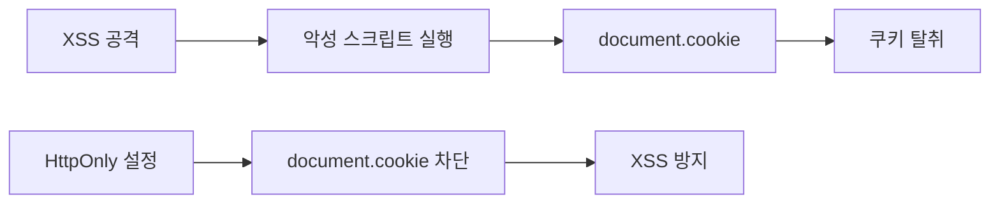
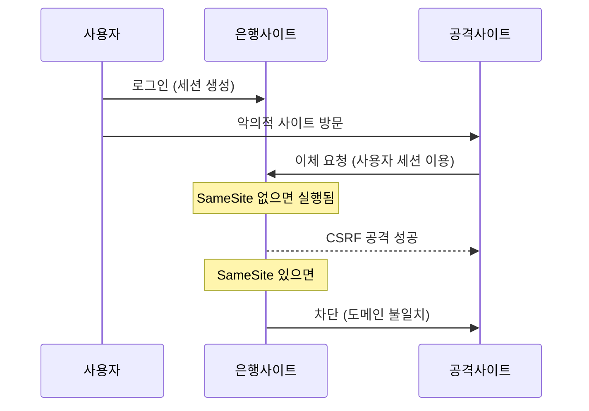

## 개요

이 문서에서는 HTTP 헤더의 구조와 종류, 쿠키 보안 설정, 캐시 제어 메커니즘, 그리고 SSL/TLS를 통한 암호화 통신에 대해 다룹니다. XSS와 CSRF 공격 방지를 위한 쿠키 보안 옵션과 캐시 검증 헤더(ETag, Last-Modified)를 학습합니다.

## HTTP 헤더

### Request 헤더 구조

HTTP Request는 줄 단위로 분리된 ASCII 문자열입니다.

**구성요소:**
- **요청 라인**: POST, GET 등의 메소드 포함
- **헤더 라인**: 다양한 헤더 정보
- **공백 라인**: 헤더와 본문 구분
- **본문(Body)**: 전송하는 데이터

**CRLF (줄바꿈 문자):**
- `\r\n`: 각 줄은 CR(13) + LF(10)로 끝납니다
- CR(Carriage Return): 제일 처음 칸으로 이동
- LF(Line Feed): 다음 줄로 이동
- `\r\n`: 헤더라인 시작과 다음 헤더가 있음을 나타냅니다
- `\r\n\r\n`: 마지막 헤더라인임을 나타냅니다

### 일반 헤더 (General Header)

서버와 클라이언트 양쪽에서 사용하는 일반적인 정보를 포함합니다.

| 헤더 | 설명 |
|------|------|
| **Date** | HTTP 메시지를 생성한 일시 (RFC 1123 규정)<br/>예: Date: Sat, Oct 2025 02:00:12 |
| **Content-Language** | 해당 개체와 가장 잘 어울리는 사용자 언어(자연언어) |
| **Cache-Control** | 캐시 유무, 업데이트 시간, 내용, 지움 등의 정보 |
| **Connection** | HTTP 전송 완료 후 TCP연결을 차단/열어둘지 결정<br/>- close: 접속 끊음<br/>- Keep-Alive: TCP 커넥션 유지 |
| **Transfer-Encoding** | entity-body의 압축 방식 |
| **Upgrade** | 프로토콜 변경 시 |
| **Via** | 중계 서버(프록시, 게이트웨이) |

### 요청 헤더 (Request Header)

| 헤더 | 설명 |
|------|------|
| **Accept** | 클라이언트가 어떤 종류의 내용을 협상할 것인지 서버에 알림 |
| **Accept-Charset** | 클라이언트에서 사용할 수 있는 문자 집합 |
| **Accept-Encoding** | 클라이언트에서 제공되는 encoding 방법(압축) |
| **Accept-Language** | 클라이언트가 인식할 수 있는 언어 |
| **Host** | 서버의 기본 URL (필수항목)<br/>Host 필드에 도메인명 및 호스트명 오류를 포함한 전체 URI(FQDN) 지정이 필요하다<br/>예) Host: developer.mozilla.org |
| **If-Match** | Entity Tag값 비교 후 Method 수행 |
| **If-None-Match** | Entity Tag값 비교 후 다를 때 Method 수행 |
| **If-Modified-Since** | 브라우저가 마지막으로 요청 자료를 받은 시간 |
| **Max-Forwards** | 이 메시지가 거치값 수 있는 최대 Proxy의 개수 지정 |
| **Proxy-Authorization** | 비공개 proxy 서버 유치 인증을 위한 코드 |
| **Range** | 자원의 일부분만 받을 때(이어받기 기능) 받을 범위 지정 |
| **From** | 메일 주소 |
| **Cookie** | 쿠키정보 (서버로부터 받은 쿠키를 다시 서버로 보냄(Set-Cookie)) |
| **Referer** | 클라이언트가 서버에 요청하기 직전에 머물렀던 주소 |
| **User-Agent** | 브라우저 정보(클라이언트 프로그램: 크롬, 사파리, 익스플로러 등) |
| **Method** | 요청 메소드 |
| **HTTP-Version** | http 버전 |
| **Request-URI** | 요청 데이터의 절대 주소, 상대주소 |
| **Authorization** | 사용자 인증 정보 |

### 응답 헤더 (Response Header)

| 헤더 | 설명 |
|------|------|
| **HTTP-Version** | http 버전 |
| **Status-code** | 응답 코드 |
| **Response-Phrase** | 응답 코드에 대한 간략한 설명 |
| **Location** | 요구한 정보의 실제 위치 정보<br/>(응답을 재전송할 때 목적지를 가리킴) |
| **Server** | 서버 프로그램의 이름과 버전 정보 (사용하고 있는 웹 서버의 정보를 제공<br/>예) Server: Apache) |
| **WWW-Authenticate** | 사용자 정보에 필요한 자원 요구 시 비밀번호 서버가 제공하는 인증방식, 인증서의 종류 및 설명내용을 다음과 같이 보낸다<br/>예)WWW-Authenticate: <type> realm=<realm><br/>요구 후 Origin Server에서 응답을 생성시킨 후 경우 |
| **Age** | 개시 출타, max-age 시간 내에서 얼마나 흘렀는지 초단위로 알려줍니다.<br/>예) max-age= 3600을 설정한 경우, 1초 후 Age: 600이 카시 출력 내역에 포함된다. |
| **Proxy-Authenticate** | 프록시 서버입 경우 유치 인증을 요구하기 위한 헤더 |
| **Public** | 서버에서 지원 가능한 메소드 리스트<br/>예) Public: GET, POST, PUT ...,서버가 해당 리소스에 대해 GET, POST, PUT 메서드를 지원한다는 의미 |
| **Retry-After** | 503 에러 시 해당 시간만큼 기다리라는 의미 |
| **Warning** | 상태 코드와 응답 구문에 추가적인 경고 |
| **Set-Cookie** | 서버 측에서 세션 쿠키 정보 설정 |
| **Expires** | cache 유효 기간으로 리소스가 지정된 일시까지 캐시됩니다.<br/>즉, 응답 content가 인제 만료 되는지를 나타냅니다. 예) Expires: Thu, 26 Jul 2018 07:28:00 GMT<br/>Cache-Control과 별개로 응답에 Expires는는 헤더를 추 수 있다.<br/>(단, Cache-Control의 max-age가 있는 경우 이 헤더는 무시된다) |
| **Last-Modified** | 리소스 마지막 수정 날 |

### 엔티티 헤더 (Entity Header)

메시지에 대한 설명을 포함하는 헤더입니다.

| 헤더 | 설명 |
|------|------|
| **Content-Encoding** | entity-body의 리소스 압축 방식(gzip, compress, 등) |
| **Content-Length** | entity-body의 리소스 크기(단위:Byte)<br/>- 전달되는 해당 개체의 바이트 길이 또는 크기(10진수)을 표시한 매시지 Body의 길이를 지정한다. 특정 지정된 개체의 길이를 지정한다. |
| **Content-Type** | entity-body의 미디어 타입<br/>- 해당 개체에 포함되는 미디어 타입 정보.<br/>- 컨텐츠의 타입 및 문자 인코딩 방식(EUC-KR,UTF-8 등)을 지정한다.<br/>- 타입(type): 10개 정도 표준으로 지정됨(application, audio, font, image, multipart 등)<br/>- 서브타입(subtype): 각 타입 별로 수 십에서 수백 개 정도됨.<br/>- 예) Content-Type: text/html; charset-latin-1해당 개체가 html 텍스트 문서이고, iso-latin-1 문자 인코딩 방식으로 표현되는 것을 의미한다. |

## 쿠키와 보안

### Set-Cookie (서버에서 클라이언트로 쿠키 전달)

**사용처:**
- 사용자 로그인 세션 관리
- 광고 정보 트래킹

**생명주기:**
- 만료일이 되면 쿠키 삭제
- 0이나 음수 지정 시 쿠키 삭제
- 세션 쿠키: 만료 날짜 생략 시 브라우저 종료까지만 유지
- 지속 쿠키: 만료 날짜 입력 시 해당 날짜까지 유지

**도메인 지정:**
- 도메인 명시: 명시한 문서 기준 도메인 + 서브 도메인 포함
  - 예: itschool.or.kr 쿠키는 exam.itschool.or.kr에서도 접근 가능
- 도메인 생략: 현재 문서 기준 도메인만 적용

**경로 지정:**
- 지정된 경로를 포함한 하위 경로 페이지만 쿠키 접근

**보안 옵션 (매우 중요!):**

**Secure:**
- HTTPS 전송인 경우에만 쿠키 전송
- 일반적으로 쿠키는 HTTP, HTTPS를 구분하지 않고 전송됩니다

**HttpOnly:**
- 자바스크립트에서 쿠키 접근 불가 (document.cookie 사용 안됨)
- HTTP 전송에서만 사용
- **XSS 공격 방지**



**SameSite:**
- 요청 도메인과 쿠키 도메인이 같은 경우만 쿠키 전송
- **CSRF(XSRF) 공격 방지**



**CSRF (Cross-Site Request Forgery):**
- 사용자의 인증된 세션을 이용해서 공격합니다
- 방어: 2번의 인증을 거쳐 진짜 사용자임을 확인합니다

## 캐시 제어

### 캐시란?

데이터나 값을 미리 복사해 놓는 임시 저장 장소입니다.

**장점:**
- 캐시 가능 시간 동안 네트워크 사용량을 줄일 수 있습니다
- 브라우저 로딩 속도가 빠릅니다
- 빠른 사용자 경험을 제공합니다

**동작:**
- 캐시 유효 시간이 초과하면 서버를 통해 데이터를 다시 조회하고 캐시를 갱신합니다

### 검증 헤더와 조건부 요청

#### Last-Modified / if-modified-since

**검증 헤더 (서버):** Last-Modified
- 응답에 최종 수정 날짜를 기록합니다

**조건부 요청 (클라이언트):** if-modified-since
- 요청 시 서버에 데이터 변경 여부를 확인합니다

**단점:**
- 1초 미만 단위로 캐시 조정이 불가능합니다
- 날짜 기반 로직을 사용합니다
- 데이터 결과가 동일해도 날짜가 다르면 다른 데이터로 인식합니다

**304 Not Modified:**
- 캐시 유효 시간 초과해도 데이터 갱신이 없으면 304 응답과 헤더 메타 정보만 전송합니다 (body 없음)

#### ETag / if-None-Match

**검증 헤더 (서버):** ETag
- 캐시용 데이터에 임의의 고유한 버전 이름을 부여합니다
- 예: Etag:"v1.0", Etag:"a2itjklsh3" (Hash 사용)

**조건부 요청 (클라이언트):** if-none-match
- ETag 값이 같으면 유지, 다르면 데이터 재전송

**장점:**
- 캐시 제어 로직을 서버에서 완전히 관리할 수 있습니다
- 클라이언트는 캐시 메커니즘을 몰라도 됩니다

**활용 예:**
- 베타 오픈 기간 3일 동안 파일 변경되어도 ETag 동일 유지
- 애플리케이션 배포 주기에 맞춰 ETag 모두 갱신

### Cache-Control 지시어

| 지시어 | 설명 |
|--------|------|
| **max-age** | 캐시 유효 시간 (초 단위) |
| **no-cache** | 데이터는 캐시해도 되지만, 항상 origin 서버에 검증하고 사용<br/>origin 서버 접근 실패 시 설정에 따라 200 OK 또는 Error 반환 |
| **no-store** | 데이터에 민감한 정보가 있으므로 저장하면 안됨<br/>(메모리에서 사용하고 최대한 빨리 삭제) |
| **must-revalidate** | 캐시 만료 후 최초 조회 시 항상 origin 서버에서 검증해야 함<br/>origin 서버 접근 실패 시 반드시 504 (Gateway Timeout) 발생 |
| **public** | 응답이 public 캐시에 저장되어도 좋다 (캐시 서버 저장 가능) |
| **private** | 사용자 PC에 캐시를 저장해야 한다 (기본값) |
| **s-maxage** | 프록시 캐시(캐시 서버)에만 적용되는 max-age |

**no-cache vs must-revalidate:**
- 공통점: origin 서버에 검증하고 사용
- 차이점: origin 서버 접근 실패 시 처리 방법의 차이
  - no-cache: 설정에 따라 200 OK 또는 Error
  - must-revalidate: 반드시 504 오류

### 캐시 무효화

확실한 캐시 무효화를 위한 설정:

```
Cache-Control: no-cache, no-store, must-revalidate
Pragma: no-cache
```

**Pragma:** HTTP 1.0 하위 호환을 위해 사용

**Expires:** 캐시 만료일 지정 (HTTP 1.0)
- 예: expires: Mon, 01 Jan 2020 00:00:00 GMT
- Cache-Control: max-age와 함께 사용 시 Expires는 무시됩니다

## SSL/TLS

### OpenSSL 설치 및 인증서 생성

**설치:**
```bash
yum -y install openssl*
```

**서버 인증서 생성 (자체 서명):**
```bash
cd /etc/pki/tls/certs
make www.isec.com.crt
cp /etc/pki/tls/certs/www.isec.com.key /etc/pki/tls/private
```

**CSR (Certificate Request) 생성:**
```bash
cd /etc/pki/tls/certs
make www.isec.com.csr
```

### Apache에 SSL/TLS 적용

**mod_ssl 설치:**
```bash
yum -y install mod_ssl
```

**SSL 설정:**
```bash
vim /etc/httpd/conf.d/ssl.conf
```

설정 내용:
```
SSLCertificateFile /etc/pki/tls/certs/www.isec.com.crt
SSLCertificateKeyFile /etc/pki/tls/private/www.isec.com.key
```

**데몬 재기동:**
```bash
systemctl restart httpd
```

### Virtual Host HTTPS 설정

```apache
<VirtualHost *:443>
    SSLEngine on
    SSLCertificateFile /etc/pki/tls/certs/www.isec1.com.crt
    SSLCertificateKeyFile /etc/pki/tls/private/www.isec1.com.key

    DocumentRoot /var/www/html/htdocs-ww1
    ServerName isec1.com
    ServerAlias www.isec1.com
    ServerAdmin ygchoi@google.com
    CustomLog logs/isec1.access.log common
    ErrorLog logs/isec1.error.log
</VirtualHost>
```

## 마무리

이번 Part 2에서는 **HTTP 보안 헤더, 쿠키 보안 옵션, 캐시 제어, SSL/TLS 암호화 통신**의 핵심 개념을 학습했습니다. **보안 HTTP 헤더**를 통해 다양한 웹 공격을 방어할 수 있습니다. X-Frame-Options는 클릭재킹 방어, X-XSS-Protection은 XSS 필터 활성화, X-Content-Type-Options는 MIME 스니핑 방지, Content-Security-Policy(CSP)는 XSS와 데이터 인젝션 공격 방어에 사용됩니다.

**쿠키 보안 옵션**의 중요성을 이해했습니다. **HttpOnly** 플래그는 JavaScript의 document.cookie 접근을 차단하여 XSS 공격으로부터 쿠키를 보호하고, **Secure** 플래그는 HTTPS 연결에서만 쿠키 전송을 허용하며, **SameSite** 속성(Strict, Lax, None)은 CSRF 공격을 방어합니다. 이러한 옵션들을 적절히 조합하면 세션 탈취와 CSRF 공격을 효과적으로 차단할 수 있습니다.

**캐시 제어 메커니즘**을 통해 성능과 보안을 동시에 확보할 수 있습니다. **Cache-Control** 헤더는 캐시 동작을 세밀하게 제어하며, no-store는 캐시 저장 금지, no-cache는 재검증 필수, private는 개인 전용 캐시, public은 공유 캐시 허용, max-age는 캐시 유효 기간을 지정합니다. **Expires** 헤더는 절대 만료 시간을 설정하고, **ETag**와 **Last-Modified**는 조건부 요청으로 대역폭을 절약합니다.

**SSL/TLS 암호화 통신**은 HTTPS의 기반입니다. TLS는 SSL의 후속 버전으로, 비대칭 키(공개키/개인키)로 세션 키를 교환하고 대칭 키로 데이터를 암호화합니다. TLS Handshake 과정(Client Hello, Server Hello, Certificate, Key Exchange)을 통해 안전한 채널을 수립하며, 인증서는 CA(Certificate Authority)가 발급하여 서버의 신원을 보증합니다. Apache에서 mod_ssl 모듈을 활성화하고 인증서를 설정하면 HTTPS 서비스를 제공할 수 있습니다.

다음 Part 3에서는 **Apache 설정과 웹 취약점**(LFI/RFI)을 학습합니다. Virtual Host 구성, Directory 접근 제어, robots.txt를 통한 크롤링 제어, 그리고 Local File Inclusion(LFI)과 Remote File Inclusion(RFI) 취약점의 원리와 방어 기법을 익히게 됩니다.

---
